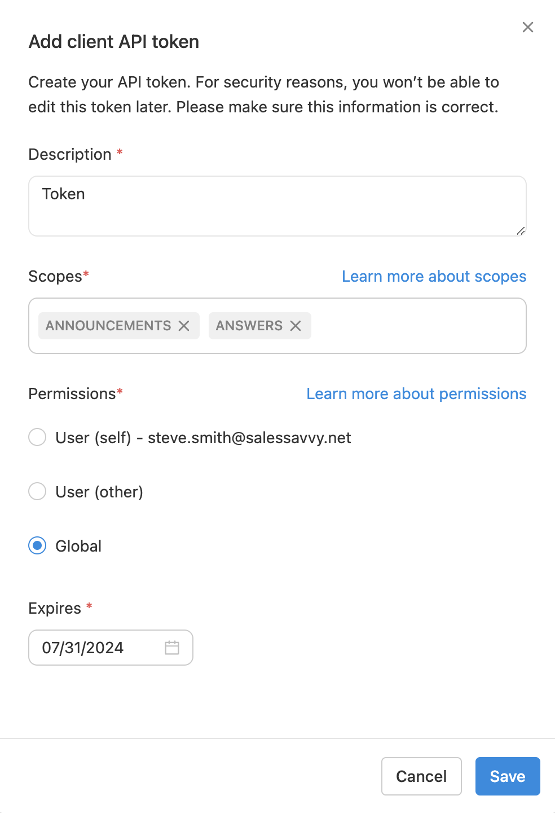

You can create tokens in [Glean's Client API Settings](#navigating-to-client-api-settings). This option is only accessible to admins. To access it:

<Frame>
  
</Frame>

1. Click on the wrench icon in the left navigation bar. This will open up the admin console.
2. On the left sidebar, navigate to **Setup** and select **API Tokens**.
3. In the API Tokens page, select the **Client Tokens** tab. Here you can see a list of all token metadata (note that the token itself won't be visible).
4. To create a new token, click **Add New Token**. In the dialogue box, fill in appropriate values for Description, Permissions, Scopes, and Expires fields, then click **Save**.

<Warning>
  The newly created token secret will only be visible once after its creation.
  Please ensure you save it securely as you won't be able to retrieve it later.
</Warning>

### Selecting Permissions and Scopes

Each token should have one associated permission and one or more scopes to be usable.

<Tip>
  The permissions and scopes assigned to a token cannot be changed after the
  token is created. Carefully select these attributes during token creation.
</Tip>

### Permissions

Permissions define the ability of the token to act on behalf of a user. The available options are:

#### GLOBAL

These tokens can make API calls on behalf of any user in the system. To identify the user for each API call, the `X-Glean-ActAs` HTTP header must be **included**, specifying the user's email address.

<Tip>
  Tokens with `GLOBAL` permissions can only be created by Super Admin users.
</Tip>

#### USER

These tokens can make API calls on behalf of a particular user. The user email is fixed while creating the token. The `X-Glean-ActAs` HTTP header must be **empty**.

#### ANONYMOUS

These tokens can make API calls on behalf of an anonymous user. The `X-Glean-ActAs` HTTP header must be **empty**.

<Tip>
  `ANONYMOUS` permissions are supported only for a few endpoints as of now.
  Please contact Glean support if you're interested to use such tokens.
</Tip>

### Scopes

Scopes define the endpoints that are available to a token. A client API token can have one or more of the following scopes:

| Scope            | Description                                                      |
| ---------------- | ---------------------------------------------------------------- |
| `ACTIVITY`       | Can access datasource user activity collection endpoints.        |
| `AGENTS`         | Can access Glean Agents related endpoints.                       |
| `ANNOUNCEMENTS`  | Can access Glean Announcements related endpoints.                |
| `ANSWERS`        | Can access Glean Answers related endpoints.                      |
| `CHAT`           | Can access GleanChat related endpoints.                          |
| `COLLECTIONS`    | Can access Glean Collections related endpoints.                  |
| `DOCPERMISSIONS` | Can access the Glean Document Permissions related endpoints.     |
| `DOCUMENTS`      | Can access endpoints related to Glean documents.                 |
| `ENTITIES`       | Can access endpoints related to entities.                        |
| `FEED`           | Can access Glean Feed related endpoints.                         |
| `FEEDBACK`       | Can access user feedback related endpoints.                      |
| `INSIGHTS`       | Can access insights related endpoints.                           |
| `PEOPLE`         | Can access Glean people related endpoints.                       |
| `PINS`           | Can access Glean pins related endpoints.                         |
| `SEARCH`         | Can access endpoints related to search queries and autocomplete. |
| `SHORTCUTS`      | Can access shortcuts feature (aka GoLinks) related endpoints.    |
| `SUMMARIZE`      | Can access AI summary related endpoints.                         |
| `VERIFICATION`   | Can access endpoints related to document verification feature.   |

When you create a token, you will select the permission and scope(s) in the "Add Client API Token" dialogue box as described in the token creation steps.
