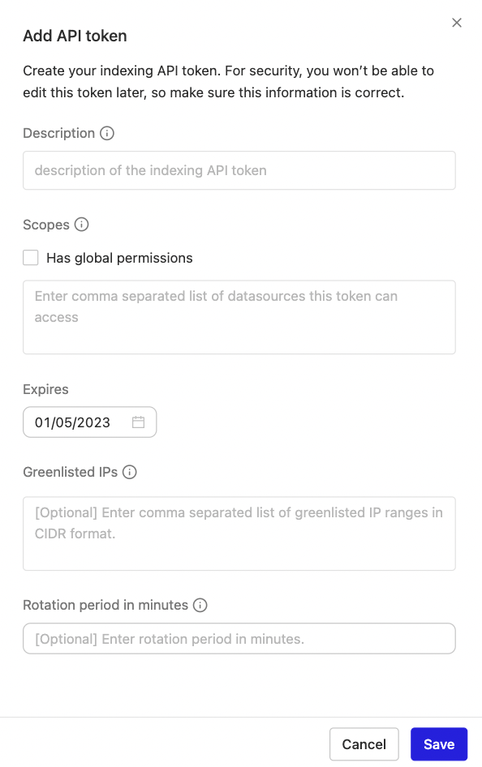

If you'd like to index documents from an internal tool or an app that Glean doesn't natively support, you can do this by using our Indexing REST API, which sends Glean documents via HTTP requests. These requests need to include an API token.

<Info>
  Admins can manage these API tokens via the [**API tokens page within the admin
  console**](https://app.glean.com/admin/platform/tokenManagement) (Admin
  console > Platform > API tokens > Indexing tokens tab).
</Info>

## Creating a new token

To get started with a token, click **"Add API token"** in the top right corner of the page. Name the token and specify whether the token has global permissions, or which apps the token has permission for. You can also set an expiry date for when the token should expire. Tokens can be revoked from the dashboard as well.

<Frame>
  
</Frame>

## Creating a token restricted to a set of IP ranges

To create a token restricted to a set of IP ranges, specify a comma separated list of IP ranges in CIDR format in the Greenlisted IPs field. This is an optional field and if not specified, requests from all IPs will be allowed. If you are not familiar with the CIDR format, read [this](https://en.wikipedia.org/wiki/Classless_Inter-Domain_Routing) wikipedia article.
Requests will only be allowed if the source IP matches at least one of the specified CIDR ranges.

<Frame>
  
</Frame>

## Creating a rotatable token

To create a rotatable token, specify the rotation period in minutes using the rotation period field.
You can use the [`/rotatetoken`](https://developers.glean.com/api-reference/indexing/authentication/rotate-token#rotate-token) indexing API endpoint to rotate these tokens. Please refer to the [Token rotation](https://developers.glean.com/docs/indexing_api_token_rotation/) documentation to get more information on rotatable tokens.

<Frame>
  
</Frame>

## Success!

Upon successful creation of the token, you will receive the following response. It is recommended to save the token in a secure place.

<Frame>
  
</Frame>
