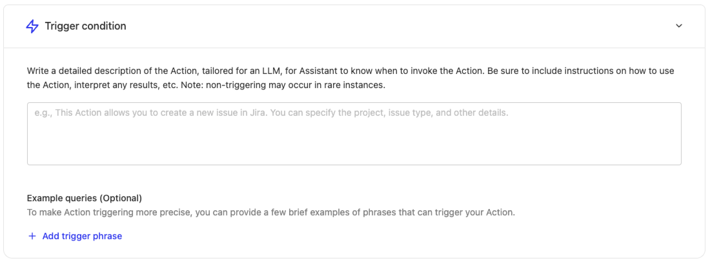
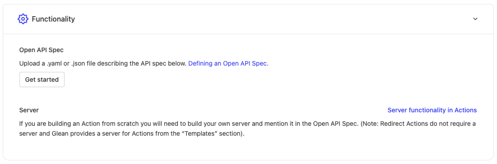

import Card from '@site/src/components/Card';
import CardGroup from '@site/src/components/CardGroup';
import { Steps } from '@site/src/components/Steps';

# Creating Actions

## Overview

Actions allow you to create automated workflows and integrations within Glean. This guide walks through the process of creating and configuring an Action.

:::note
You must have an `Admin` or `App and Action Creator` role to create actions.
:::

To get started, navigate to [Admin console > Platform > Actions](https://app.glean.com/admin/platform/tools) where you'll see a list of all available actions. Click the "New Action" button in the top right corner to begin.

You can choose to create a custom action from scratch, build a simple redirect action or pick from one of the available out-of-the-box actions (if enabled for you).

:::tip
For Gmail or Jira creation actions, you can use built-in templates with no coding required. For other use cases, you can create custom actions from scratch.
:::

If you select creating an action from scratch, these are the steps to create an action:

<Steps>
  

    <h3>Step 1: Basic Information</h3>
    
Start by providing the essential details to identify your action:

    
    <table>
      <thead>
        <tr>
          <th>Field</th>
          <th>Type</th>
          <th>Required</th>
          <th>Description</th>
        </tr>
      </thead>
      <tbody>
        <tr>
          <td><strong>Display name</strong></td>
          <td>string</td>
          <td>✓</td>
          <td>The name that will be shown in the actions directory</td>
        </tr>
        <tr>
          <td><strong>Display description</strong></td>
          <td>string</td>
          <td>✓</td>
          <td>A clear description of what your action does</td>
        </tr>
        <tr>
          <td><strong>Unique identifier</strong></td>
          <td>string</td>
          <td>✓</td>
          <td>A unique identifier to distinguish your action from others with similar names</td>
        </tr>
        <tr>
          <td><strong>Action type</strong></td>
          <td>string</td>
          <td>✓</td>
          <td>Choose between: • <strong>Action</strong>: Performs operations in external apps • <strong>Retrieval</strong>: Fetches information from external applications</td>
        </tr>
      </tbody>
    </table>

    <h4>Action Types in Detail</h4>

    <CardGroup cols={2}>
      <Card title="Action" icon="Zap">
        Helps users perform operations in external apps. Can be either:
        - **Execution**: Performs the action directly within Glean
        - **Redirect**: Sends users to the appropriate external URL
      </Card>
      <Card title="Retrieval" icon="Download">
        Fetches information from external applications that may or may not be indexed with Glean
      </Card>
    </CardGroup>
  

  

    <h3>Step 2: Trigger Condition</h3>
    
Configure when your action should be triggered in Glean Chat.

    

    

      
When users interact with Glean Chat, the system matches their requests against the trigger conditions to determine which action to use.

    

    
For example, for an IT support Action, you might include trigger conditions like:

    
"Creates IT support tickets on JIRA. Use this action when the user wants to create a support ticket, needs access to something or wants help with any IT related issues."

    
You can also provide example queries such as:

    <ul>
      <li>"I forgot my password for Notion"</li>
      <li>"Need to reset my password for gmail"</li>
      <li>"I need access to gong"</li>
    </ul>
  

  

    <h3>Step 3: Functionality</h3>
    
Define the specific configurations for your action.

    
For actions created from scratch, you'll need to upload an API spec:

    
  

  

    <h3>Step 4: Authentication</h3>
    
    

      
This step is only required for actions with a server.

    

    
Configure how Glean should pass authentication information for requests coming from Glean to your action's server.

  

</Steps>

## Testing and Deployment

### Testing Your Action

After saving your action, use the testing link provided at the bottom of the page to verify its functionality. Test with various queries that should trigger the action and refine the Trigger Condition if needed.

### Deployment Options

Actions can be deployed in two environments:

<CardGroup cols={2}>
  <Card title="Chat Deployment" icon="MessageCircle">
    Deploy to all users (recommended after thorough testing) or a subset of users for testing
  </Card>
  <Card title="Glean Agents" icon="agent" iconSet="glean">
    Deploy for use in Glean Agents
  </Card>
</CardGroup>

## API Specification Configuration

:::note
This section only applies to custom actions built from scratch.
:::

When configuring the API spec for your action, provide a YAML or JSON file that follows these requirements:

- Contains a single endpoint defined in /paths (e.g., /execute)
- Fields should be added in either requestBody.content or parameters
- All fields must follow this format:
  - No nested fields (only string/number/integer/boolean or arrays of these types)
  - Use enum with a single value for fixed values
  - Assistant can guess non-fixed values
  - Mark required fields using standard OpenAPI specifications

For example implementations and API specs, refer to our [examples documentation](/guides/actions/examples/jira-issue-creation). 