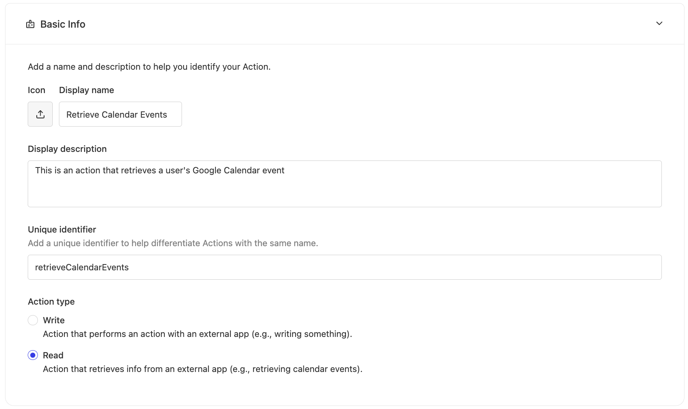
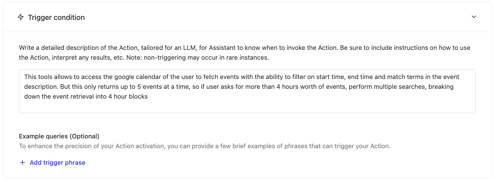
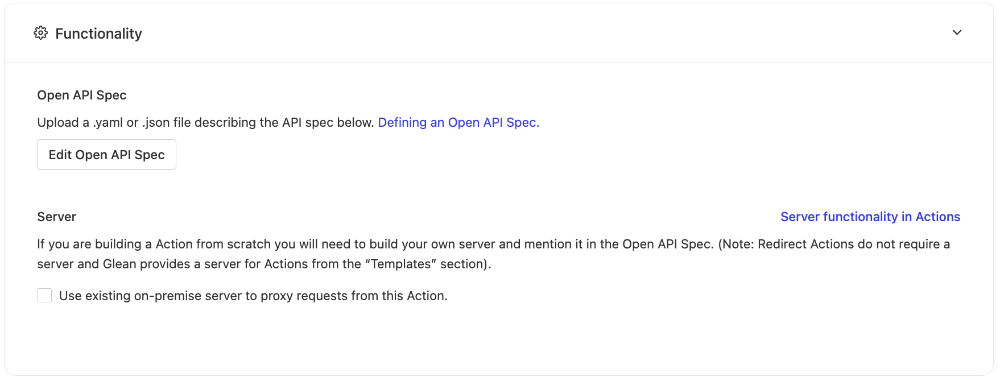
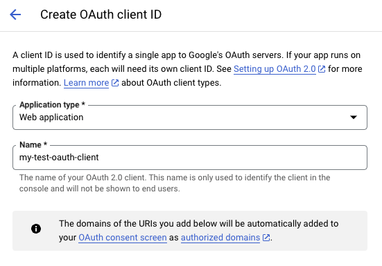
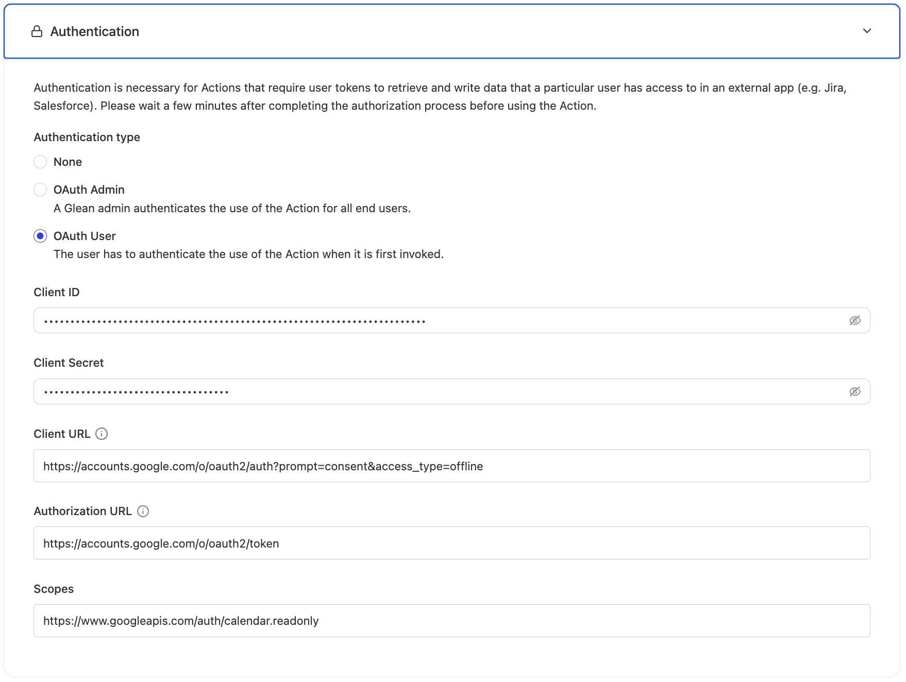
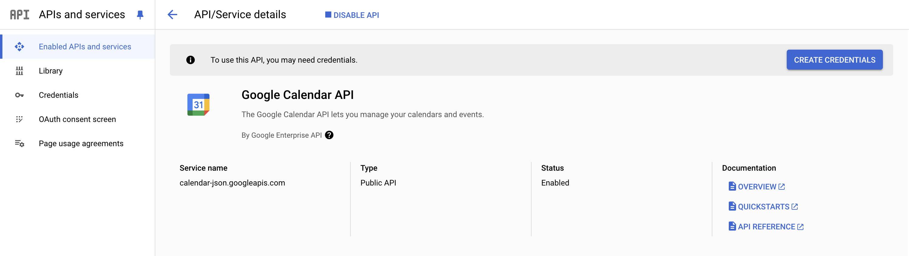
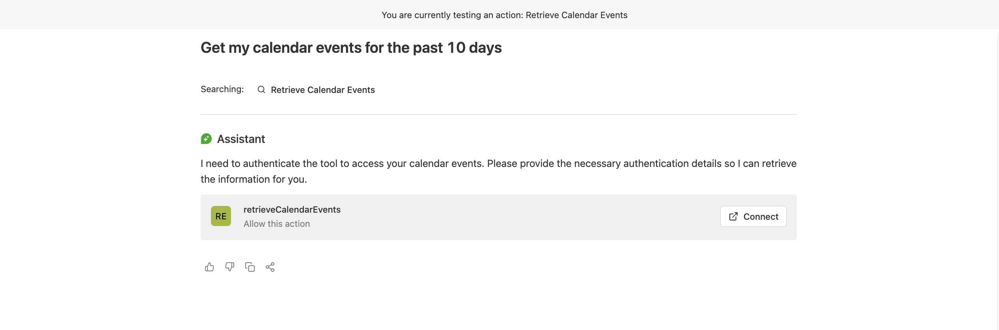
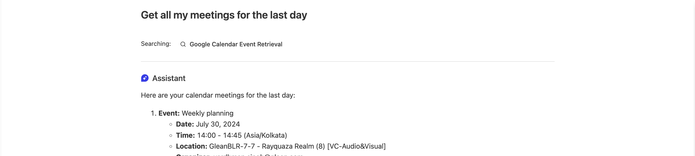

import Card from '@site/src/components/Card';
import CardGroup from '@site/src/components/CardGroup';
import { Steps, Step } from '@site/src/components/Steps';

# Google Calendar Events Retrieval Action

## Overview

This guide walks through creating a retrieval action that allows Glean Assistant to access and display Google Calendar events. This integration enables users to query their calendar events directly through Glean's interface with proper OAuth authentication and secure API access.

This is a **retrieval action** that fetches calendar data from Google Calendar API with OAuth User authentication.

## Prerequisites

Before beginning this implementation, ensure you have:

- Administrator access to your Glean instance
- Access to Google Cloud Console with appropriate permissions
- Understanding of OAuth 2.0 authentication flows

## Implementation Guide

<Steps>
  <Step title="Creating the Base Action">
    <p>Begin by navigating to <a href="https://app.glean.com/admin/platform/tools">Admin console > Platform > Actions</a> and selecting "New Action".</p>

    :::info
    Choose "start from scratch" since the Google Calendar action isn't available in the templates.
    :::

    <h4>Basic Information Configuration</h4>
    [](./images/google-calendar-events/calendar_action_basic_info.png)

    <p>Configure these essential details:</p>
    <ul>
      <li><strong>Display Name</strong>: Choose a clear, descriptive name (e.g., "Calendar Events Retrieval")</li>
      <li><strong>Description</strong>: Explain the action's purpose and capabilities</li>
      <li><strong>Unique Identifier</strong>: Set a unique ID (e.g., "retrieveCalendarEvents")</li>
      <li><strong>Action Type</strong>: Select "Retrieval" since this action reads calendar data</li>
    </ul>

    <h4>Trigger Condition Setup</h4>
    [](./images/google-calendar-events/calendar_action_trigger_condition.png)

    <p>Your trigger condition should clearly specify:</p>
    <ul>
      <li>When Glean Assistant should use this action</li>
      <li>Expected user query patterns</li>
      <li>Scenarios where the action shouldn't be used</li>
    </ul>
  </Step>

  <Step title="Configuring the API Specification">
    <p>Add this OpenAPI specification to define how Glean Assistant interacts with the Google Calendar API:</p>

    <details>
      <summary>Click to expand the complete OpenAPI specification</summary>

    ```yaml
    openapi: 3.0.1
    servers:
      - url: 'https://www.googleapis.com/calendar/v3/'
    info:
      title: Google Calendar Events API
      description: This API returns events on the primary calendar of the currently logged-in user.
      version: 1.0.0
    paths:
      /calendars/primary/events:
        get:
          summary: List Events
          description: Retrieves events from the primary calendar.
          parameters:
            - name: timeMin
              in: query
              description: |
                Lower bound (exclusive) for an event's start time to filter by. Must be an RFC3339 timestamp with a mandatory time zone offset. Its very important to have timestamp in Z format
                Example: 2011-06-03T10:00:00Z
              required: false
              schema:
                type: string
                format: date-time
            - name: timeMax
              in: query
              description: |
                Upper bound (exclusive) for an event's start time to filter by. Must be an RFC3339 timestamp with a mandatory time zone offset. Its very important to have timestamp in Z format
                Example: 2011-06-03T10:00:00Z
              required: false
              schema:
                type: string
                format: date-time
            - name: q
              in: query
              description: Free text search terms to find events that match these terms in various fields such as summary, description, location, etc.
              required: false
              schema:
                type: string
          responses:
            '200':
              description: A list of events.
              content:
                application/json:
                  schema:
                    type: object
                    properties:
                      items:
                        type: array
                        items:
                          type: object
                          properties:
                            id:
                              type: string
                              description: Identifier of the event.
                            status:
                              type: string
                              description: Status of the event (confirmed, tentative, cancelled).
                            summary:
                              type: string
                              description: Title of the event.
                            description:
                              type: string
                              description: Description of the event.
                            start:
                              type: object
                              properties:
                                dateTime:
                                  type: string
                                  format: date-time
                                  description: The start time of the event.
                            end:
                              type: object
                              properties:
                                dateTime:
                                  type: string
                                  format: date-time
                                  description: The end time of the event.
    ```

    </details>

    [](./images/google-calendar-events/calendar_action_functionality.png)

    :::warning
    Leave the "Use existing on-premise server" option unchecked since we're accessing Google's API directly.
    :::
  </Step>

  <Step title="Setting Up OAuth Authentication">
    <p>This action requires OAuth User authentication to access individual users' calendar data.</p>

    <h4>Google Cloud Console Setup</h4>
    
    1. Access the [Google Cloud Console Credentials page](https://console.cloud.google.com/apis/credentials)
    2. Create OAuth credentials:

       [](./images/google-calendar-events/calendar_action_gcs_cloud_create_cred.png)
    
    3. Configure as a web application:

       [](./images/google-calendar-events/calendar_action_create_oauth_client.png)

    <h4>Redirect URI Configuration</h4>
    <p>Add this URI to your OAuth client (Note your instance name is typically the email domain without the TLD):</p>
    <pre><code>https://{`{instance-name}-be.glean.com/tools/oauth/verify_code/{your-action-unique-identifier-name}`}</code></pre>

    <h4>OAuth Settings in Glean</h4>
    <p>Configure these parameters in Glean:</p>
    <pre><code>{`Client URL: https://accounts.google.com/o/oauth2/auth?prompt=consent&access_type=offline
Authorization URL: https://accounts.google.com/o/oauth2/token
Scopes: https://www.googleapis.com/auth/calendar.readonly`}</code></pre>

    [](./images/google-calendar-events/calendar_action_authentication.png)

    <h4>Enable Google Calendar API</h4>
    
    1. Access your Google Cloud Console
    2. Enable the Calendar API:

       [](./images/google-calendar-events/calendar_action_google_api.png)
  </Step>

  <Step title="Testing and Deployment">
    <p>Test the action thoroughly before deployment.</p>

    <h4>Initial Testing</h4>
    
    1. Use the provided testing URL
    2. You'll see the connection banner:

       [](./images/google-calendar-events/calendar_action_connect_banner.png)
    
    3. Authenticate with Google
    4. Verify event retrieval:

       [](./images/google-calendar-events/calendar_action_calendar_events.png)

    <h4>Deployment</h4>
    <p>Configure deployment settings:</p>
    [](./images/google-calendar-events/deploy_window.png)

    <p>Set appropriate access controls:</p>
    <ul>
      <li>Enable for all teammates or</li>
      <li>Restrict to specific team members</li>
    </ul>
  </Step>
</Steps>

## Best Practices

### API Specification Design

<CardGroup cols={2}>
  <Card title="Parameter Configuration" icon="Settings">
    When configuring the Calendar API parameters:
    
    - Use RFC3339 format for all date-time fields
    - Include timezone offsets in timestamp examples
    - Provide clear descriptions for search parameters
    - Consider default values for time ranges
  </Card>

  <Card title="Response Handling" icon="RotateCcw">
    Important considerations for handling calendar data:
    
    - Process multiple calendar event types (recurring, all-day, etc.)
    - Handle timezone conversions appropriately
    - Consider pagination for large result sets
    - Process cancelled or declined events properly
  </Card>
</CardGroup>

### Authentication Implementation

<Card title="OAuth Setup" icon="Key">
  Critical OAuth implementation details:
  
  - Always use `access_type=offline` for refresh token support
  - Request minimal scopes (readonly for calendar access)
  - Handle token refresh scenarios gracefully
  - Implement proper token storage and security
</Card>

### Performance Optimization

<CardGroup cols={2}>
  <Card title="Query Optimization" icon="Zap">
    Optimize calendar queries by:
    
    - Using appropriate time ranges
    - Implementing result caching
    - Limiting returned fields
    - Managing API quota usage
  </Card>

  <Card title="Error Handling" icon="AlertTriangle">
    Implement robust error handling:
    
    - Handle quota limit scenarios
    - Manage token expiration gracefully
    - Provide meaningful error messages
    - Implement retry logic for transient failures
  </Card>
</CardGroup>

## Testing & Validation

<CardGroup cols={3}>
  <Card title="Authentication Testing" icon="Key">
    **Verify that:**
    - OAuth flow completes successfully
    - Tokens are properly stored and refreshed
    - Unauthorized access is prevented
    - Scope permissions are correctly enforced
  </Card>

  <Card title="Data Retrieval Testing" icon="Download">
    **Confirm that:**
    - Events are retrieved accurately
    - Time zone handling is correct
    - Search functionality works properly
    - Different calendar types are supported
  </Card>

  <Card title="Integration Testing" icon="Plug">
    **Validate that:**
    - The action integrates smoothly with Glean Assistant
    - Response formatting is appropriate
    - Error scenarios are handled gracefully
    - Performance meets expectations
  </Card>
</CardGroup>

### Common Implementation Challenges

:::warning
Watch out for these common issues:

1. **Time Zone Handling**
   - Inconsistent timezone formatting
   - Missing timezone offsets
   - Incorrect local time conversions

2. **Calendar Access**
   - Primary vs. secondary calendar confusion
   - Shared calendar permissions
   - Resource calendar access

3. **Event Filtering**
   - Inefficient time range queries
   - Missing recurring event instances
   - Incomplete search term matching

4. **OAuth Configuration**
   - Incorrect redirect URIs
   - Missing required scopes
   - Token refresh failures
:::

## Security Considerations

<Card title="Security Best Practices" icon="Lock">
  Important security measures for calendar integration:

  - **Scope Minimization**: Request only necessary permissions (readonly for retrieval)
  - **Token Security**: Implement secure token storage and transmission
  - **Access Logging**: Log access patterns for security monitoring
  - **Data Privacy**: Ensure calendar data is handled according to privacy policies
</Card>

## Troubleshooting

If you encounter issues:

1. **Verify OAuth Configuration**
   - Check credential settings in Google Cloud Console
   - Confirm correct scopes are requested
   - Validate redirect URIs match exactly

2. **Check API Access**
   - Confirm Calendar API is enabled in Google Cloud Console
   - Verify quota availability and limits
   - Check user permissions for calendar access

3. **Debug Authentication Flow**
   - Test the OAuth flow manually
   - Check for proper token generation and refresh
   - Validate scope permissions

4. **Review Implementation**
   - Validate timestamp formats in API calls
   - Check parameter formatting and encoding
   - Verify error handling logic

## Next Steps

After successful implementation:

1. **Documentation**: Create user guides for calendar integration features
2. **Monitoring**: Set up dashboards for tracking usage and performance
3. **Support**: Establish procedures for handling user issues
4. **Enhancement**: Plan feature expansions based on user feedback
5. **Reviews**: Schedule regular system and security reviews 