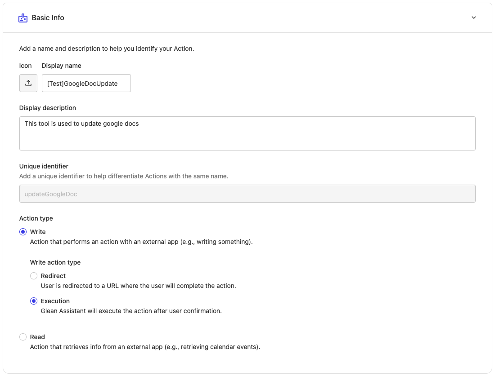
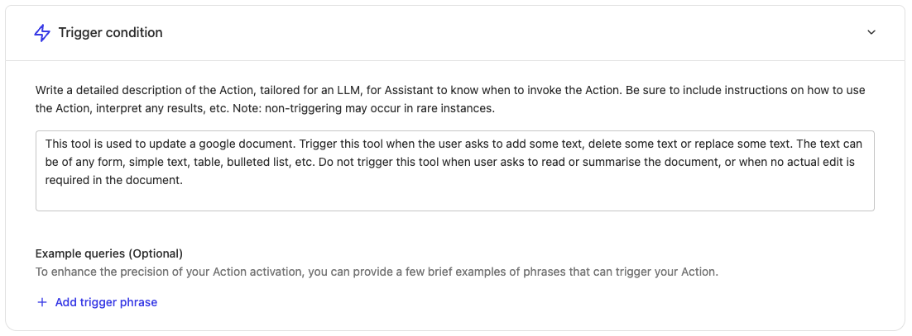
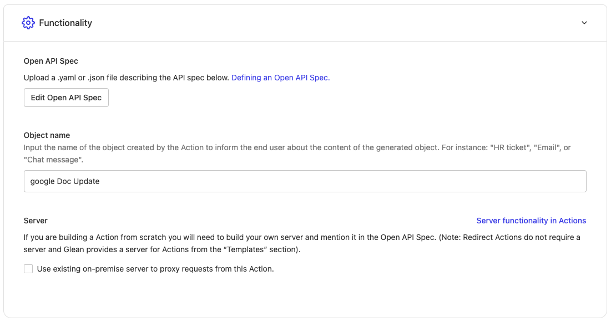
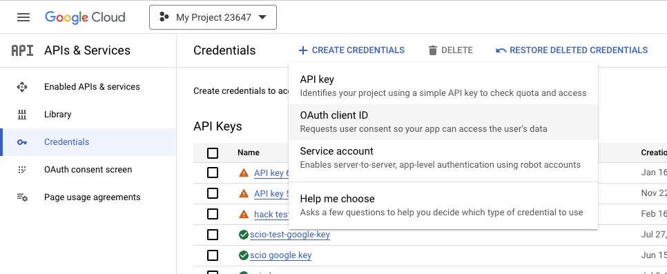
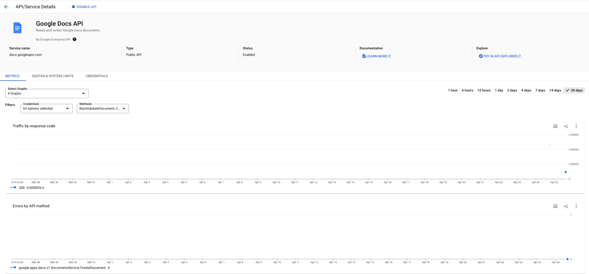
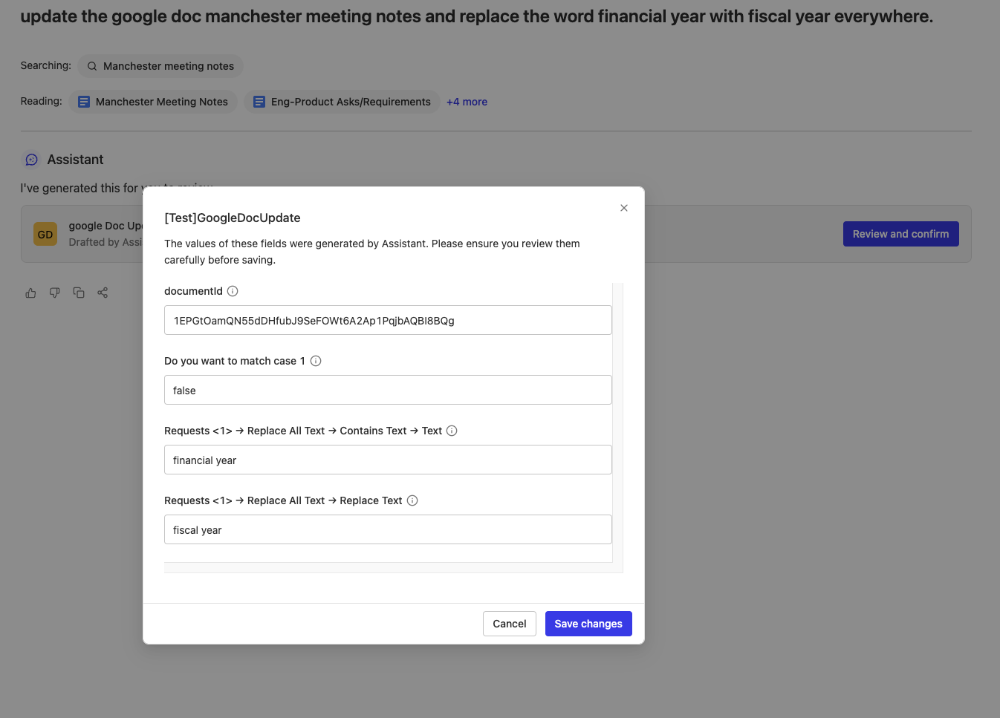
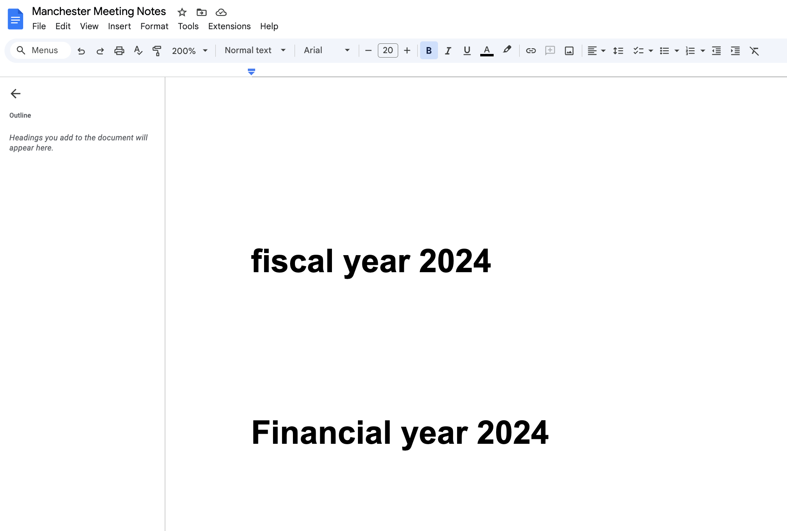
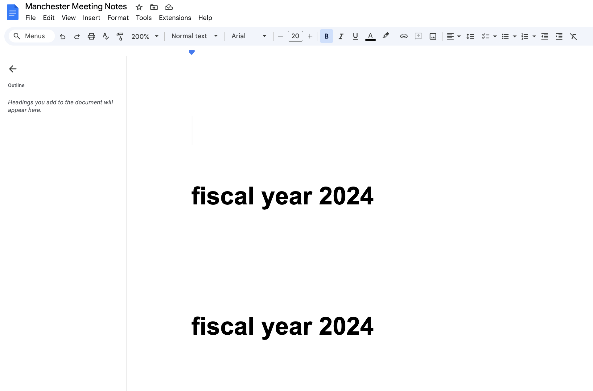

import Card from '@site/src/components/Card';
import CardGroup from '@site/src/components/CardGroup';
import { Steps, Step } from '@site/src/components/Steps';

# Google Docs Update Action

## Overview

This guide demonstrates how to create an execution action that enables Glean Assistant to update Google Documents. You'll learn how to configure the OpenAPI specification, set up OAuth authentication, and deploy the action for use within your organization.

This is an **execution action** that performs operations directly within Glean by making API calls to Google Docs on behalf of users.

## Prerequisites

Before proceeding, ensure you have:

- Admin or app developer access to Glean
- Access to Google Cloud Console
- Familiarity with OAuth 2.0 authentication flows

## Implementation Guide

<Steps>
  <Step title="Action Manifest Configuration">
    
Navigate to <a href="https://app.glean.com/admin/platform/tools">Admin console > Platform > Actions</a> and create a new action from scratch.

    <h4>Basic Information Configuration</h4>
    
    

    
Configure the following settings:

    <ul>
      <li>Display name: Choose a descriptive name (e.g., "Google Docs Updater")</li>
      <li>Description: Explain the action's functionality</li>
      <li>Unique identifier: Set a unique ID (e.g., "googleDocsUpdate")</li>
      <li>Action type: Select "Action" since this will modify documents</li>
    </ul>

    <h4>Trigger Condition Setup</h4>
    
    

    
In the trigger condition, provide comprehensive guidance for when Glean Assistant should use this action. Include:

    <ul>
      <li>Specific use cases that should trigger the action</li>
      <li>Examples of appropriate user queries</li>
      <li>Cases where the action should not be used</li>
    </ul>
  </Step>

  <Step title="API Specification Development">
    
The first step involves creating a properly formatted OpenAPI specification that defines how Glean Assistant will interact with the Google Docs API. We'll use the following endpoint:

    <pre><code>POST https://docs.googleapis.com/v1/documents/{`{documentId}`}:batchUpdate</code></pre>

    

      
While Google doesn't typically provide OpenAPI specs publicly, you can construct one using their <a href="https://developers.google.com/docs/api/reference/rest/v1/documents/batchUpdate">documentation</a> or reference third-party sources.

    

    
Here's the complete OpenAPI specification:

    

      
Click to expand the full OpenAPI specification

    <pre><code>{`openapi: 3.0.0
servers:
  - url: 'https://docs.googleapis.com/'
info:
  description: Writes Google Docs documents.
  title: Google Docs API
  version: v1
paths:
  '/v1/documents/{documentId}:batchUpdate':
    post:
      description: >-
        Applies one or more updates to the document. Each request is validated
        before being applied. If any request is not valid, then the entire
        request will fail and nothing will be applied. The updates in your request
        are guaranteed to be applied together atomically.
      operationId: docs.documents.batchUpdate
      parameters:
        - description: >-
            The ID of the document to update. Use glean search to find
            the relevant document. The documentId usually exists in the
            url of the doc. The syntax of URL (with documentId) is like:
            https://docs.google.com/document/d/<documentId>/edit
            Extract out the documentId from the URL.
          in: path
          name: documentId
          required: true
          schema:
            type: string
      requestBody:
        content:
          application/json:
            schema:
              type: object
              properties:
                requests:
                  type: array
                  maxItems: 2
                  items:
                    type: object
                    properties:
                      insertText:
                        description: >-
                          Inserts text at the specified location. Always use this
                          operation except when text deletion or text replacement
                          is required.
                        type: object
                        properties:
                          location:
                            type: object
                            properties:
                              index:
                                description: >-
                                  The zero-based index, in UTF-16 code units.
                                  Strictly use a value of 1 and nothing else.
                                format: int32
                                type: integer
                          text:
                            description: >-
                              The text to be inserted. This is the most important field
                              for this text inserting operation. Insert a neatly
                              formatted text consisting of multiple paragraphs. Whenever
                              required, always start with a new line for paragraphs,
                              tables, lists for neatness.
                            type: string
                      replaceAllText:
                        description: >-
                          Replaces all instances of the specified text.
                          Always use this operation when text deletion
                          or text replacement is required.
                        type: object
                        properties:
                          containsText:
                            type: object
                            properties:
                              matchCase:
                                description: >-
                                  Indicates whether the search should respect
                                  case: - \`True\`: the search is case sensitive.
                                  - \`False\`: the search is case insensitive.
                                type: boolean
                                title: Do you want to match case
                              text:
                                description: The text to search for in the document.
                                type: string
                          replaceText:
                            description: >-
                              The text that will replace the
                              matched text. Keep empty for deletion.
                            type: string
      responses:
        '200':
          description: Successful response`}</code></pre>

    

    <h4>Functionality Configuration</h4>
    
    

    
Paste the OpenAPI specification you prepared above. Since we're using Google's API directly, leave the "Use existing on-premise server" option unchecked.

  </Step>

  <Step title="Authentication Setup">
    
The action requires OAuth 2.0 authentication to interact with Google Docs securely.

    <h4>Google Cloud Console Configuration</h4>
    
    1. Visit the [Google Cloud Console Credentials page](https://console.cloud.google.com/apis/credentials)
    2. Create new OAuth 2.0 credentials:

       
    
    3. Select "Web Application" as the application type:

       

    <h4>Redirect URI Configuration</h4>
    
Add the following redirect URI to your OAuth client configuration (Note your instance name is typically the email domain without the TLD):

    <pre><code>https://{`{instance-name}-be.glean.com/tools/oauth/verify_code/{your-action-unique-identifier-name}`}</code></pre>

    

      
The unique identifier in the redirect URI must match exactly with the identifier you set when creating the action, including case sensitivity.

    

    <h4>OAuth Settings in Glean</h4>
    
Configure these OAuth settings in the Authentication section:

    <pre><code>{`Client URL: https://accounts.google.com/o/oauth2/auth?prompt=consent&access_type=offline
Authorization URL: https://accounts.google.com/o/oauth2/token
Scopes: https://www.googleapis.com/auth/documents`}</code></pre>

    <h4>Enable Google Docs API</h4>
    
    1. Navigate to the Google Cloud Console
    2. Enable the Google Docs API for your project:

       
  </Step>

  <Step title="Testing and Deployment">
    
After configuration, thoroughly test the action before deployment.

    <h4>Testing Process</h4>
    
    1. Click the testing URL provided after saving the action
    2. Issue test queries to verify proper triggering
    3. Use the "Review and confirm" interface:

       
    
    4. Verify document changes:

       Before changes:
       

       After changes:
       

    <h4>Deployment Configuration</h4>
    
Deploy the action through the deploy tab:

    
    

    
You can:

    <ul>
      <li>Enable the action for all teammates</li>
      <li>Restrict access to specific teammates</li>
      <li>Configure deployment settings for Chat or AI Apps integration</li>
    </ul>
  </Step>
</Steps>

## Best Practices

### API Configuration Best Practices

When preparing your OpenAPI specification for Google Docs integration:

<CardGroup cols={2}>
  <Card title="Field Descriptions" icon="BookOpen">
    The quality of field descriptions significantly impacts Glean Assistant's ability to populate them correctly. Consider these guidelines:

    - Make descriptions actionable and specific
    - Include examples of valid values
    - Explain the business context of each field
    - Clarify relationships between fields
  </Card>

  <Card title="Schema Structure" icon="GitBranch">
    Your schema structure affects how Glean Assistant interprets the API:

    - Keep the schema as flat as possible
    - Use meaningful field names that reflect their purpose
    - Leverage built-in formats (like `date-time`) where applicable
    - Include proper type constraints and validations
  </Card>
</CardGroup>

### Authentication Considerations

<Card title="OAuth Configuration" icon="Key">
  Important considerations for OAuth setup:

  - Always use `access_type=offline` to enable refresh tokens
  - Include appropriate error handling for token expiration
  - Consider implementing token rotation for security
  - Monitor token usage and implement proper logging
</Card>

### Performance Optimization

<CardGroup cols={2}>
  <Card title="User Experience" icon="User">
    Optimize the action for user interaction:

    - Provide clear feedback when the action is processing
    - Include meaningful error messages
    - Allow users to preview changes before applying them
    - Maintain consistent behavior across different document types
  </Card>

  <Card title="Efficient Operations" icon="Zap">
    Ensure efficient operation:

    - Batch related operations when possible
    - Implement appropriate timeouts
    - Cache frequently used document metadata
    - Monitor action execution times
  </Card>
</CardGroup>

### Error Handling

When working with the Google Docs API:

<CardGroup cols={2}>
  <Card title="Document Operations" icon="Edit">
    Choose the right operation type for your use case:

    - Use `insertText` for adding new content without affecting existing text
    - Use `replaceAllText` when you need to modify existing content
    - Consider using `index: 1` for insertions to maintain consistent behavior
    - Handle formatting through plain text markers (like asterisks for bullets)
  </Card>

  <Card title="Common Issues" icon="AlertTriangle">
    Common issues to watch for:

    - Document permissions mismatches
    - Rate limiting constraints
    - Invalid document IDs
    - Concurrent modification conflicts
  </Card>
</CardGroup>

## Testing & Validation

<Card title="Comprehensive Testing" icon="CheckCircle">
  Implement thorough testing across these scenarios:

  - Different document types and sizes
  - Various content modification patterns
  - Edge cases in text replacement
  - Multiple user permission levels
  - Concurrent access situations
</Card>

### Common Pitfalls to Avoid

:::warning
Watch out for these common implementation mistakes:

1. **Document ID Handling**
   - Not properly extracting IDs from URLs
   - Failing to validate ID format
   - Not handling shared drive documents correctly

2. **Permission Issues**
   - Insufficient OAuth scopes
   - Missing document-level permissions
   - Incorrect service account configuration

3. **Content Formatting**
   - Ignoring existing document structure
   - Not handling special characters properly
   - Incorrect handling of line breaks and paragraphs
:::

## Troubleshooting

If you encounter issues during setup or execution:

1. **Verify OAuth Configuration**
   - Check OAuth credentials are correctly configured
   - Ensure the Google Docs API is enabled
   - Validate that the redirect URI exactly matches your action's configuration

2. **Check Permissions**
   - Verify the user has appropriate permissions in both Glean and Google Docs
   - Confirm document access permissions
   - Check API quota and rate limits

3. **Debug Implementation**
   - Validate document ID extraction and formatting
   - Test with different document types and sizes
   - Monitor API response codes and error messages

## Next Steps

After successful implementation, consider:

- **Documentation**: Creating documentation for end users
- **Monitoring**: Setting up monitoring for action usage
- **Credentials**: Establishing a process for maintaining OAuth credentials
- **Reviews**: Planning for periodic reviews of API specifications as the Google Docs API evolves
- **Enhancements**: Expanding functionality based on user feedback 