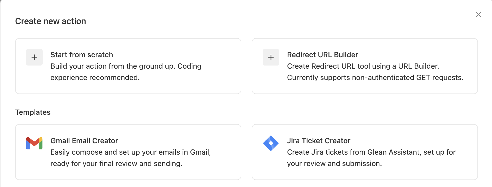
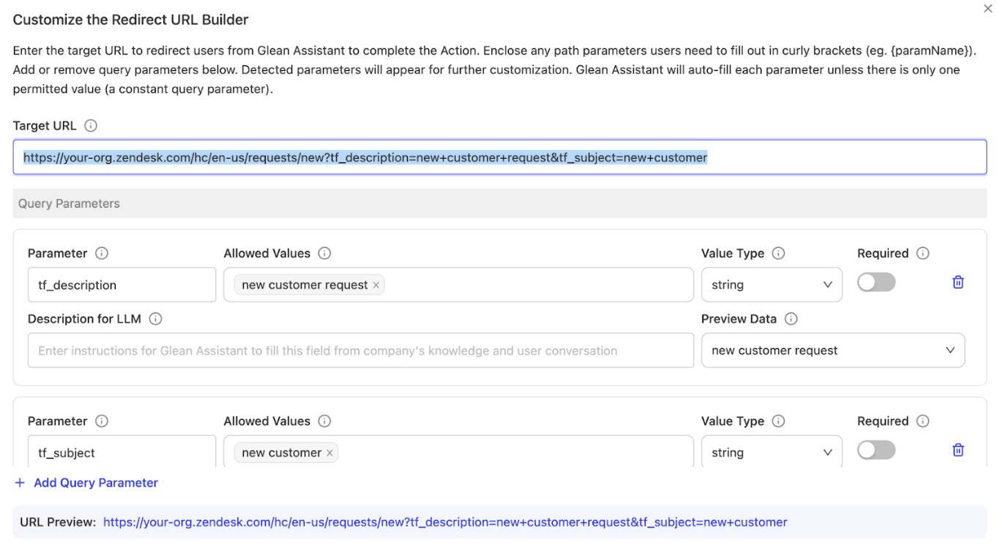
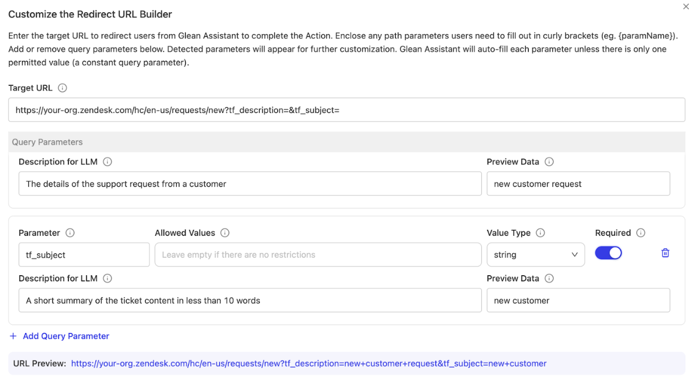
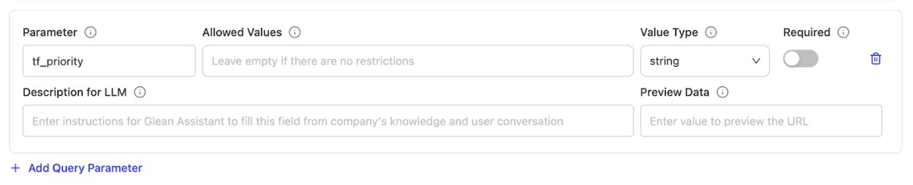
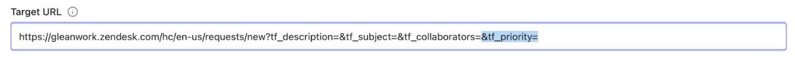
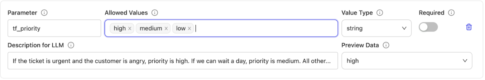
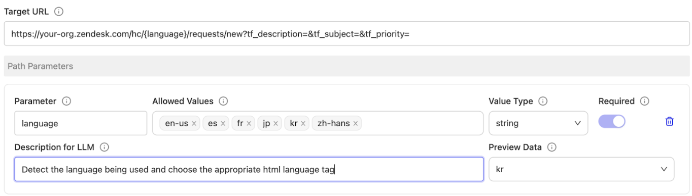

import Card from '@site/src/components/Card';
import CardGroup from '@site/src/components/CardGroup';

# Zendesk Ticket Creation

## Overview

This guide explains how to create a redirect action that allows users to create Zendesk tickets through Glean Assistant. The implementation uses Glean's Redirect URL Builder to construct properly formatted URLs that pre-populate ticket fields in Zendesk's interface. This approach provides a streamlined experience for users while maintaining the familiar Zendesk environment for ticket creation.

## Understanding Redirect Actions

Before diving into the implementation, it's important to understand that redirect actions differ from execution actions. Instead of directly creating tickets via API calls, redirect actions construct URLs that guide users to Zendesk's ticket creation interface with relevant information already filled in. This approach offers several advantages:

<Card title="Redirect Action Benefits" icon="ArrowRight">
  - **User Control**: Users can review and modify ticket details before submission
  - **Simplified Setup**: No need for complex API authentication handling
  - **Familiar Interface**: Maintains familiar Zendesk interface for end users
  - **Low Maintenance**: Reduces implementation complexity and maintenance overhead
</Card>

## Implementation Process

### Initial Setup

Begin at the Actions settings page in your Glean administration console. When creating a new action, you'll find the Redirect URL Builder option among the available choices.



The Redirect URL Builder provides a user-friendly interface for configuring URL parameters and their behaviors. This tool significantly simplifies the process of creating redirect actions compared to manual URL construction.

### Basic Configuration

The initial configuration requires several key pieces of information that establish the foundation of your redirect action.

<Card title="Basic Action Configuration" icon="Settings">
  **Display Name**: Choose a clear, descriptive name that helps users understand the action's purpose

  **Description**: Explain when and how the action should be used

  **Unique Identifier**: Create a distinctive identifier for system reference

  **Trigger Conditions**: Define the scenarios that should activate this action
</Card>

When selecting the action type, the system automatically sets this to "Redirect" based on your use of the URL Builder.

### URL Structure Setup

The foundation of the redirect action is the Zendesk ticket creation URL. The standard format follows this structure:

```text
https://your-org.zendesk.com/hc/en-us/requests/new
```

When you include query parameters for field population, the URL expands to include these values:

<details>
  <summary>Click to see example URL with parameters</summary>

```text
https://your-org.zendesk.com/hc/en-us/requests/new?tf_description=new+customer+request&tf_subject=new+customer
```

</details>



### Parameter Configuration

The effectiveness of your redirect action depends heavily on proper parameter configuration. Each parameter requires careful consideration to ensure Glean Assistant can populate it appropriately.

<Card title="Parameter Configuration Steps" icon="List">
  1. **Clear Static Values**: Remove any static values from the "Allowed Values" field
  2. **Provide LLM Guidance**: Add detailed instructions in the "Description for LLM" field
  3. **Set Requirements**: Configure requirement settings based on your ticketing workflow
</Card>



Essential parameters for Zendesk ticket creation typically include:

<CardGroup cols={2}>
  <Card title="Description Field" icon="FileText">
    **Parameter Name**: `tf_description`

    **Purpose**: Contains the detailed explanation of the issue or request

    **Configuration**: Enable dynamic population with clear LLM instructions

    **Requirement**: Usually marked as required for meaningful ticket creation
  </Card>

  <Card title="Subject Field" icon="Hash">
    **Parameter Name**: `tf_subject`

    **Purpose**: Provides a concise summary of the ticket content

    **Configuration**: Allow dynamic generation based on ticket context

    **Requirement**: Typically required for proper ticket organization
  </Card>
</CardGroup>

### Extending Parameter Functionality

The system provides two methods for adding additional parameters to enhance ticket creation functionality.

**Method 1: Add Parameter Link**



**Method 2: Direct URL Modification**



### Parameter Value Controls

For parameters that require specific values, the system provides robust control mechanisms:



<Card title="Value Control Implementation" icon="CheckSquare">
  When implementing value controls:

  1. **Enter Values Systematically**: Use the Enter key to separate individual entries
  2. **Provide Clear Instructions**: Include context about value selection criteria
  3. **Ensure Compatibility**: Values must align exactly with Zendesk's expectations
  4. **Include Usage Context**: Explain when each value should be used
</Card>

### Advanced URL Configuration

For implementations requiring path parameters:



<Card title="Path Parameters" icon="Route">
  Path parameters become integral parts of the URL structure and require careful handling to ensure proper functionality. These parameters must be marked as required since they form essential components of the URL construction.
</Card>

## Implementation Considerations

### Security Aspects

While redirect actions don't require direct API authentication, several security considerations remain important:

<CardGroup cols={3}>
  <Card title="URL Parameter Validation" icon="Shield">
    - Implement proper encoding for all parameter values
    - Validate parameter content before inclusion
    - Consider length limitations for URL parameters
  </Card>

  <Card title="User Authorization" icon="UserCheck">
    - Ensure users have appropriate Zendesk access
    - Consider implementing additional authorization checks if needed
    - Monitor usage patterns for security anomalies
  </Card>

  <Card title="Data Protection" icon="Lock">
    - Validate that sensitive data isn't exposed in URLs
    - Implement appropriate data sanitization
    - Monitor for potential data leakage
  </Card>
</CardGroup>

### Performance Optimization

Several factors contribute to optimal performance:

<CardGroup cols={2}>
  <Card title="URL Construction Efficiency" icon="Gauge">
    - Minimize parameter count to reduce URL length
    - Implement efficient parameter value generation
    - Consider caching frequently used values
  </Card>

  <Card title="Response Time Management" icon="Clock">
    - Monitor redirect timing metrics
    - Optimize parameter generation processes
    - Implement appropriate timeout handling
  </Card>
</CardGroup>

### User Experience Enhancement

Consider these aspects to provide an optimal user experience:

<CardGroup cols={2}>
  <Card title="Parameter Population Clarity" icon="Eye">
    - Provide clear feedback about parameter values
    - Allow for user modification when needed
    - Maintain consistent parameter behavior
  </Card>

  <Card title="Error Handling" icon="AlertTriangle">
    - Implement clear error messages
    - Provide guidance for error resolution
    - Monitor common error patterns
  </Card>
</CardGroup>

## Implementation Testing

Comprehensive testing should include:

<CardGroup cols={3}>
  <Card title="Functionality Verification" icon="TestTube">
    **Test Areas:**
    - Parameter population accuracy
    - Redirect behavior
    - Field pre-population in Zendesk
  </Card>

  <Card title="Error Scenario Testing" icon="AlertCircle">
    **Test Scenarios:**
    - Invalid parameter combinations
    - Error handling mechanisms
    - User feedback systems
  </Card>

  <Card title="Performance Assessment" icon="BarChart">
    **Performance Metrics:**
    - Response times
    - Behavior under load
    - Various parameter combinations
  </Card>
</CardGroup>

## Maintenance Procedures

Establish regular maintenance practices:

<CardGroup cols={3}>
  <Card title="Parameter Monitoring" icon="Search">
    - Review parameter usage patterns
    - Update parameter descriptions as needed
    - Adjust value constraints based on feedback
  </Card>

  <Card title="Performance Tracking" icon="TrendingUp">
    - Monitor redirect success rates
    - Track parameter population accuracy
    - Assess user satisfaction metrics
  </Card>

  <Card title="Documentation Management" icon="BookOpen">
    - Maintain current parameter documentation
    - Update user guides as needed
    - Document common issues and solutions
  </Card>
</CardGroup>

## Advanced Features

<Card title="Enhanced Functionality Options" icon="Plus">
  For more sophisticated implementations, consider:

  - **Dynamic Field Mapping**: Implement context-aware field population based on request type
  - **Template Integration**: Use predefined templates for common ticket types
  - **Multi-Org Support**: Configure for multiple Zendesk organizations
  - **Custom Field Support**: Include organization-specific custom fields
  - **Conditional Logic**: Implement parameter population based on user roles or departments
</Card>

## Troubleshooting Guide

:::warning
Common implementation challenges and solutions:

1. **Parameter Encoding Issues**
   - Ensure special characters are properly URL-encoded
   - Test with various content types and languages
   - Verify encoding compatibility with Zendesk

2. **Field Mapping Problems**
   - Confirm field names match Zendesk configuration
   - Test with different user permission levels
   - Validate custom field accessibility

3. **URL Length Limitations**
   - Monitor generated URL lengths
   - Implement content truncation for long descriptions
   - Consider parameter prioritization strategies
:::

## Monitoring and Analytics

<Card title="Key Metrics to Track" icon="BarChart3">
  Establish monitoring for these critical metrics:

  - **Redirect Success Rate**: Percentage of successful redirects to Zendesk
  - **Parameter Population Accuracy**: How often fields are correctly populated
  - **User Completion Rate**: Percentage of users who submit tickets after redirect
  - **Error Frequency**: Common error patterns and their resolution
  - **Performance Metrics**: Response times and system load impacts
</Card>

## Best Practices Summary

<Card title="Implementation Best Practices" icon="CheckCircle">
  Follow these guidelines for optimal results:

  - **Clear Parameter Descriptions**: Provide comprehensive LLM guidance for each parameter
  - **User Testing**: Conduct thorough testing with real users before deployment
  - **Gradual Rollout**: Implement phased deployment to identify issues early
  - **Feedback Collection**: Establish channels for user feedback and improvement suggestions
  - **Regular Reviews**: Schedule periodic reviews of parameter accuracy and user satisfaction
</Card>

## Next Steps

After implementing the Zendesk ticket creation redirect action:

1. **Documentation**: Create comprehensive user documentation
2. **Monitoring**: Establish monitoring systems
3. **Maintenance**: Define maintenance schedules
4. **Enhancement**: Plan future enhancements
5. **Feedback**: Configure feedback collection mechanisms

This implementation provides a robust foundation for streamlined ticket creation while maintaining the flexibility and familiarity of the Zendesk interface. Regular monitoring and maintenance will ensure continued effectiveness and user satisfaction. 