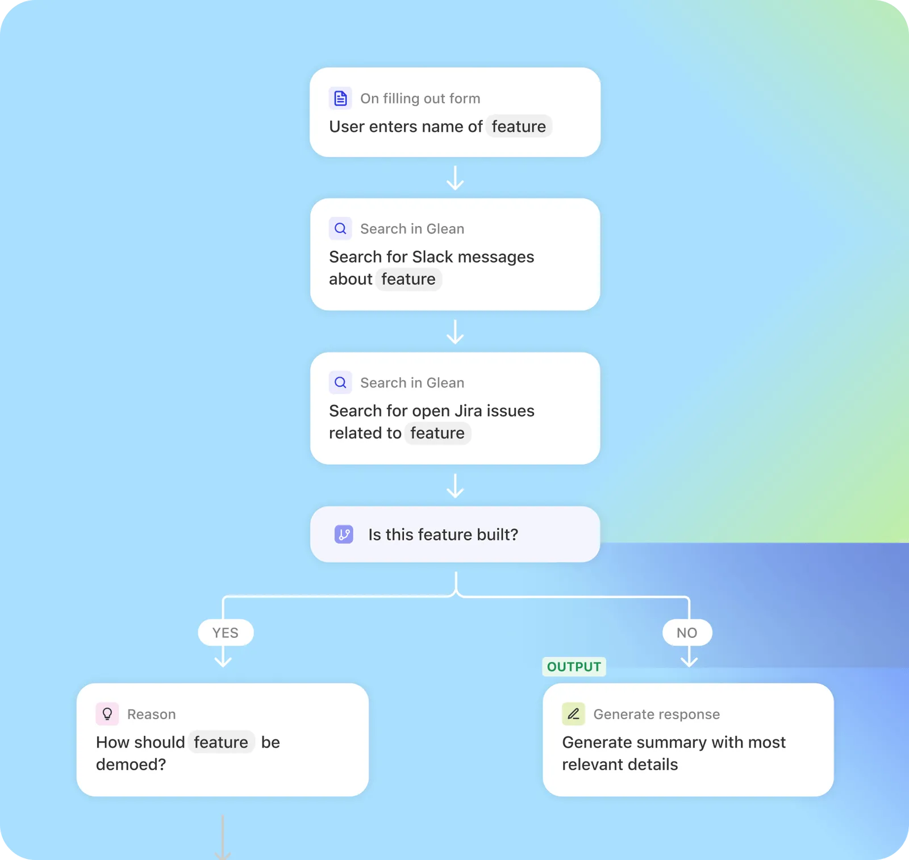

Glean agents enable you to build, deploy, and manage AI agents across your organization. The Agents API provides programmatic control over these agents.

<Card title="Go to Agents API Reference" href="https://app.glean.com" icon="agents">
</Card>

### Use Cases

The Agents API enables:

- Integrating Glean agents with external applications
- Retrieving agent responses for your applications
- Streaming agent responses to chat interfaces
- Discovering available agents in your deployment
- Monitoring agent changes by examining input and output schemas

### Agent Builder

Users in your organization can create and configure agents through Glean's no-code/low-code Agent Builder interface.

### Considerations

- The Agents API implements a subset of the [LangChain Agent Protocol](https://langchain-ai.github.io/agent-protocol/api.html#tag/agents), specifically [Runs](https://langchain-ai.github.io/agent-protocol/api.html#tag/runs) and [Agents](https://langchain-ai.github.io/agent-protocol/api.html#tag/agents), ensuring compatibility with any agent runtime that supports this standard.
- You can look up an agent ID by examining the Agent Builder URL.
  
