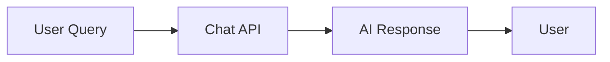
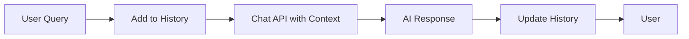
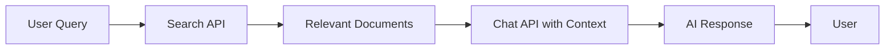

import Card from '@site/src/components/Card';
import CardGroup from '@site/src/components/CardGroup';

# Building Chat Applications

Glean's Chat API enables you to build powerful conversational AI applications that can access your organization's knowledge. Whether you're creating a simple chatbot or a complex conversational interface, Glean provides the tools you need.

## Key Features

- **Conversational AI**: Natural language conversations with context awareness
- **Enterprise Knowledge**: Access to your organization's indexed content
- **Streaming Responses**: Real-time response streaming for better user experience
- **Citation Support**: Automatic source citations for transparency
- **Multi-turn Conversations**: Maintain context across conversation turns

## Getting Started

<CardGroup cols={2}>
  <Card 
    title="Chat API Overview"
    icon="chat"
    iconSet="glean"
    href="/api/client-api/chat/overview"
  >
    Learn about the Chat API endpoints and capabilities
  </Card>
  
  <Card 
    title="Chatbot Example"
    icon="MessageCircle"
    href="/guides/chat/chatbot-example"
  >
    Build a complete chatbot using Glean's client libraries
  </Card>
  
  <Card 
    title="Authentication"
    icon="Shield"
    href="/api-info/client/authentication/overview"
  >
    Set up authentication for your chat application
  </Card>
  
  <Card 
    title="Client Libraries"
    icon="Code"
    href="/libraries/api-clients"
  >
    Use our official SDKs for Python, TypeScript, Go, and Java
  </Card>
</CardGroup>

## Common Use Cases

### Customer Support Chatbot
Build a chatbot that can answer customer questions using your help documentation, FAQs, and knowledge base.

### Internal Knowledge Assistant
Create an internal tool that helps employees find company policies, procedures, and documentation.

### Developer Assistant
Build a coding assistant that can search through your codebase, documentation, and best practices.

### Sales Enablement Tool
Develop a tool that helps sales teams find relevant case studies, product information, and competitive intelligence.

## Architecture Patterns

### Simple Request-Response
For basic Q&A scenarios where each query is independent.

### Conversational with Memory
For multi-turn conversations that maintain context.

### RAG Pattern
For responses that need specific document context.

## Best Practices

### Message Structure
- Use clear, specific queries for better results
- Include relevant context in system messages
- Structure conversations with proper message types

### Error Handling
- Implement retry logic for transient failures
- Handle rate limiting gracefully
- Provide fallback responses for API errors

### Performance Optimization
- Use streaming for real-time responses
- Implement caching for frequently asked questions
- Optimize message history length

### Security Considerations
- Validate and sanitize user inputs
- Implement proper authentication
- Respect user permissions and data access

## Next Steps

1. **Start Simple**: Begin with the [Chatbot Example](/guides/chat/chatbot-example)
2. **Explore APIs**: Review the [Chat API Reference](/api/client-api/chat/overview)
3. **Choose Your Stack**: Select a [Client Library](/libraries/api-clients)
4. **Deploy**: Consider hosting and scaling requirements

## Related Guides

- [Agents Guide](/guides/agents/overview) - For more complex AI workflows
- [Search Guide](/guides/search/overview) - For document retrieval patterns
- [Authentication Guide](/api-info/client/authentication/overview) - For secure API access 