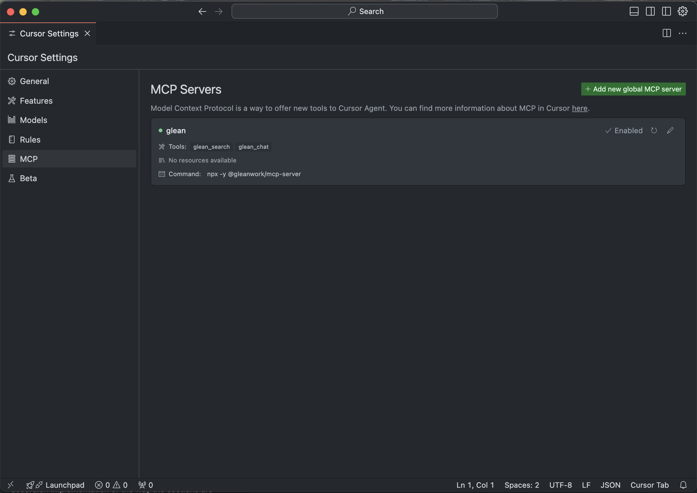
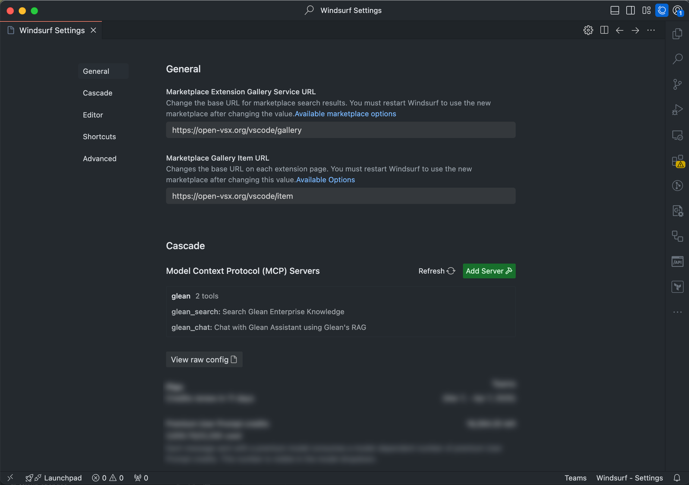
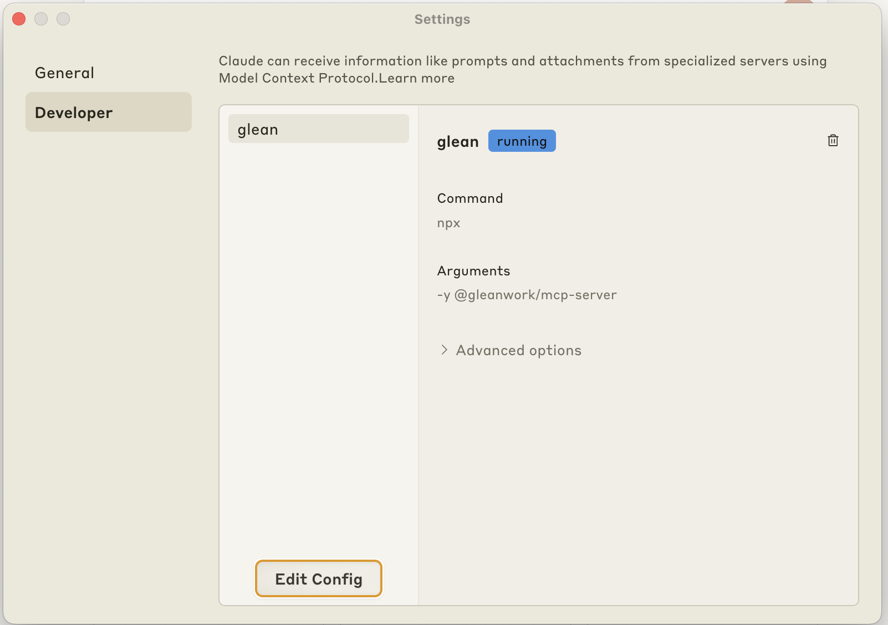

import Tabs from '@theme/Tabs';
import TabItem from '@theme/TabItem';
import { McpIcon } from '@site/src/components/Icons';

# <McpIcon className="inline" height="1.4rem" /> Glean MCP Integration: Choose Your Approach

Glean offers two ways to integrate with Model Context Protocol (MCP) to enable AI models to securely access and search your organization's knowledge:

<CardGroup cols={2}>
  <Card 
    title="Local MCP Server"
    icon="laptop"
    href="#local-mcp-server-available-now"
  >
    **✅ Available Now**
    
    Self-hosted MCP server you install and configure locally. Full control over setup and immediate availability for any MCP-compatible application.
  </Card>
  
  <Card 
    title="Remote MCP Server"
    icon="cloud"
    href="#remote-mcp-server-private-beta"
  >
    **🔒 Private Beta**
    
    Built directly into Glean's platform. No local setup required, enterprise-grade hosting with enhanced security and performance.
  </Card>
</CardGroup>

## Which Approach Should I Use?

Choose the approach that best fits your needs:

| Factor | Local MCP Server | Remote MCP Server |
|--------|------------------|-------------------|
| **Availability** | ✅ Available now | 🔒 Private beta - contact Glean team |
| **Setup** | Install & configure locally | No setup required |
| **Maintenance** | You manage updates & hosting | Glean manages everything |
| **Security** | Runs on your infrastructure | Enterprise-grade Glean infrastructure |
| **Performance** | Depends on your local setup | Enterprise SLA with guaranteed uptime |
| **Ideal For** | Developers, quick testing, full control | Enterprise deployments, production use |

:::tip Quick Start Recommendation
If you're just getting started or want to test MCP integration, begin with the Local MCP Server. You can always migrate to the Remote MCP Server when it becomes generally available.
:::

---

## Local MCP Server (Available Now)

The Local MCP Server is a self-hosted solution that you install and run on your own infrastructure. This gives you full control over the setup and allows immediate access to Glean's MCP capabilities.

<Card
  title="@gleanwork/mcp-server"
  icon="github"
  iconStyle="brands"
  href="https://github.com/gleanwork/mcp-server"
>
  [](https://badge.fury.io/js/@gleanwork%2Fmcp-server)
  
  Official local MCP server implementation for Glean's search and chat capabilities
</Card>

### Features

- **Enterprise Search**: Access Glean's powerful content search capabilities
- **Chat Interface**: Interact with Glean's AI assistant
- **MCP Compliant**: Implements the Model Context Protocol specification
- **Cross-Platform**: Works with Cursor, VS Code, Windsurf, Claude Desktop, and more
- **Easy Setup**: Simple CLI configuration for popular MCP clients

### Available Tools

The Glean MCP server provides the following tools:

#### `company_search`

Search Glean's content index using the Glean Search API. This tool allows you to query Glean's content index with various filtering and configuration options.

#### `chat`

Interact with Glean's AI assistant using the Glean Chat API. This tool allows you to have conversational interactions with Glean's AI, including support for message history, citations, and various configuration options.

#### `people_profile_search`

Search Glean's People directory to find employee information.

### Configuration

#### API Tokens

You'll need Glean [API credentials](/get-started/authentication), and specifically a [user-scoped API token](/api-info/client/authentication/overview). API Tokens require the following scopes: `chat`, `search`. You should speak to your Glean administrator to provision these tokens.

:::warning
Currently, our MCP implementation uses API tokens for authentication. While the MCP specification includes [optional authorization mechanisms](https://spec.modelcontextprotocol.io/specification/2025-03-26/basic/authorization/) and there is [an active RFC to add OAuth 2.0 support](https://github.com/modelcontextprotocol/specification/pull/133), we're using a simple token-based approach for now. Once the OAuth specification is finalized and widely adopted in the MCP ecosystem, we plan to implement OAuth-based authentication for enhanced security and user management.
:::

#### IDE Integrations

<Accordion title="Cursor">
### Configure Cursor

<Tabs>
  <TabItem value="configure-using-the-cli" label="Configure using the CLI">

    <Steps>
          <Step title="Get Credentials">
            Ensure you have your Glean API credentials ready from the [Configuration](#configuration) section above. You'll need:
            - Your Glean instance name
            - A [user-scoped API token](/api-info/client/authentication/overview)
          </Step>

          <Step title="Configure Cursor">
            Run the following command to configure Cursor to use Glean's MCP server. This will add a new MCP server to Cursor's settings.

            Using explicit `domain` and `token` flags:
            ```bash
            npx @gleanwork/mcp-server configure --client cursor --instance <your-glean-instance-name> --token <your-glean-api-token>
            ```

            Using a `.env` file:
            ```bash
            npx @gleanwork/mcp-server configure --client cursor --env <path-to-env-file>
            ```
          </Step>

          <Step title="Test the Integration">
            :::note
            Since MCP [does not mandate a specific tool discovery interface](https://spec.modelcontextprotocol.io/specification/2024-11-05/server/tools/), you may need to explicitly prompt Cursor's AI to use Glean's tools. Try prefixing your questions with phrases like "Using Glean, ..." or "Search in Glean for ..." to help the AI understand which tool to use.
            :::

            1. Open a new chat in Cursor
            2. Try a query like "Using Glean, what's our company's policy on remote work?"
            3. Verify that Cursor can access and search your Glean content
          </Step>
        </Steps>

    </TabItem>

  <TabItem value="configure-manually" label="Configure manually">

<Steps>
      <Step title="Get Credentials">
        Ensure you have your Glean API credentials ready from the [Configuration](#configuration) section above. You'll need:
        - Your Glean instance name
        - A [user-scoped API token](/api-info/client/authentication/overview)
      </Step>

      <Step title="Configure Cursor">
        1. Click "Cursor" in the menu bar
        2. Select "Settings"
        3. Click "Cursor Settings"
        4. Navigate to the "MCP" section
        5. Click "Add new global MCP server"
        6. Add the following configuration to the opened `mcp.json` file:

        ```json
        {
          "mcpServers": {
            "glean": {
              "command": "npx",
              "args": ["-y", "@gleanwork/mcp-server"],
              "env": {
                "GLEAN_INSTANCE": "<your-glean-instance-name>",
                "GLEAN_API_TOKEN": "<your-glean-api-token>"
              }
            }
          }
        }
        ```
        7. Close the file to save the configuration

        Your MCP server should now be listed and Enabled, as shown below.

        <Frame>
          
        </Frame>
      </Step>

      <Step title="Test the Integration">
        :::note
          Since MCP [does not mandate a specific tool discovery interface](https://spec.modelcontextprotocol.io/specification/2024-11-05/server/tools/), you may need to explicitly prompt Cursor's AI to use Glean's tools. Try prefixing your questions with phrases like "Using Glean, ..." or "Search in Glean for ..." to help the AI understand which tool to use.
        :::

        1. Open a new chat in Cursor
        2. Try a query like "Using Glean, what's our company's policy on remote work?"
        3. Verify that Cursor can access and search your Glean content
      </Step>
    </Steps>

</TabItem>
</Tabs>
</Accordion>

<Accordion title="Windsurf">
### Configure Windsurf

<Tabs>
  <TabItem value="configure-using-the-cli" label="Configure using the CLI">

<Steps>
      <Step title="Get Credentials">
        Ensure you have your Glean API credentials ready from the [Configuration](#configuration) section above. You'll need:
        - Your Glean instance name
        - A [user-scoped API token](/api-info/client/authentication/overview)
      </Step>
      <Step title="Configure Windsurf">
        Run the following command to configure Windsurf to use Glean's MCP server. This will add a new MCP server to Windsurf's settings.

        Using explicit `domain` and `token` flags:
        ```bash
        npx @gleanwork/mcp-server configure --client windsurf --instance <your-glean-instance-name> --token <your-glean-api-token>
        ```

        Using a `.env` file:
        ```bash
        npx @gleanwork/mcp-server configure --client windsurf --env <path-to-env-file>
        ```
      </Step>
      <Step title="Test the Integration">
        :::note
          Since MCP [does not mandate a specific tool discovery interface](https://spec.modelcontextprotocol.io/specification/2024-11-05/server/tools/), you may need to explicitly prompt Cascade to use Glean's tools. Try prefixing your questions with phrases like "Using Glean, ..." or "Search in Glean for ..." to help Cascade understand which tool to use.
        :::

        1. Open a new chat in Windsurf
        2. Try a query like "Using Glean, what's our company's policy on remote work?"
        3. Verify that Windsurf can access and search your Glean content
      </Step>
    </Steps>

</TabItem>

  <TabItem value="configure-manually" label="Configure manually">

<Steps>
      <Step title="Get Credentials">
        Ensure you have your Glean API credentials ready from the [Configuration](#configuration) section above. You'll need:
        - Your Glean instance name
        - A [user-scoped API token](/api-info/client/authentication/overview)
      </Step>

      <Step title="Configure Windsurf">
        1. Click "Windsurf" in the menu bar
        2. Select "Settings"
        3. Click "Windsurf Settings"
        4. Under "Cascade / Model Context Protocol (MCP) Servers"
        5. Click "Add Server"
        6. Click "Add Custom Server"
        7. Add the following configuration to the opened `mcp_config.json` file:

        ```json
        {
          "mcpServers": {
            "glean": {
              "command": "npx",
              "args": ["-y", "@gleanwork/mcp-server"],
              "env": {
                "GLEAN_INSTANCE": "<your-glean-instance-name>",
                "GLEAN_API_TOKEN": "<your-glean-api-token>"
              }
            }
          }
        }
        ```
        8. Close the file to save the configuration

        Your MCP server should now be listed in the servers section, as shown below.

        <Frame>
          
        </Frame>
      </Step>


      <Step title="Test the Integration">
        :::note
          Since MCP [does not mandate a specific tool discovery interface](https://spec.modelcontextprotocol.io/specification/2024-11-05/server/tools/), you may need to explicitly prompt Cascade to use Glean's tools. Try prefixing your questions with phrases like "Using Glean, ..." or "Search in Glean for ..." to help Cascade understand which tool to use.
        :::

        1. Open a new chat in Windsurf
        2. Try a query like "Using Glean, what's our company's policy on remote work?"
        3. Verify that Windsurf can access and search your Glean content
      </Step>
    </Steps>

</TabItem>
</Tabs>
</Accordion>

<Accordion title="VS Code">
### Configure VS Code

<Tabs>
  <TabItem value="global-configuration" label="Global configuration">

VS Code supports global MCP server configuration that applies across all your workspaces. This is ideal for personal use.

    <Tabs>
      <TabItem value="configure-cli-global" label="Configure using the CLI">
        <Steps>
          <Step title="Get Credentials">
            Ensure you have your Glean API credentials ready from the [Configuration](#configuration) section above. You'll need:
            - Your Glean instance name
            - A [user-scoped API token](/api-info/client/authentication/overview)
          </Step>

          <Step title="Configure VS Code">
            Run the following command to configure VS Code to use Glean's MCP server globally.

            Using explicit `instance` and `token` flags:
            ```bash
            npx @gleanwork/mcp-server configure --client vscode --instance <your-glean-instance-name> --token <your-glean-api-token>
            ```

            Using a `.env` file:
            ```bash
            npx @gleanwork/mcp-server configure --client vscode --env <path-to-env-file>
            ```
          </Step>

          <Step title="Test the Integration">
            :::note
              VS Code has native MCP support with agent mode. You can access MCP tools through the Chat view in agent mode. Look for the **Tools** button to manage available MCP servers and tools.
            :::

            1. Open the Chat view in VS Code (⌃⌘I / Ctrl+Alt+I)
            2. Select **Agent** mode from the dropdown
            3. Click the **Tools** button to view available MCP tools
            4. Try a query like "Using Glean, what's our company's policy on remote work?"
            5. Verify that VS Code can access and search your Glean content
          </Step>
        </Steps>

</TabItem>

      <TabItem value="configure-manually" label="Configure manually">

<Steps>
          <Step title="Get Credentials">
            Ensure you have your Glean API credentials ready from the [Configuration](#configuration) section above. You'll need:
            - Your Glean instance name
            - A [user-scoped API token](/api-info/client/authentication/overview)
          </Step>

          <Step title="Configure VS Code">
            1. Open VS Code Command Palette (⌘⇧P / Ctrl+Shift+P)
            2. Run **"MCP: Add Server"** command
            3. Select **"User Settings"** when prompted
            4. Or manually edit your `settings.json` and add:

            ```json
            {
              "mcp": {
                "servers": {
                  "glean": {
                    "type": "stdio",
                    "command": "npx",
                    "args": ["-y", "@gleanwork/mcp-server"],
                    "env": {
                      "GLEAN_INSTANCE": "<your-glean-instance-name>",
                      "GLEAN_API_TOKEN": "<your-glean-api-token>"
                    }
                  }
                }
              }
            }
            ```

            5. Use **"MCP: List Servers"** command to view and manage your configured servers
          </Step>

          <Step title="Test the Integration">
            :::note
              VS Code has native MCP support with agent mode. You can access MCP tools through the Chat view in agent mode. Look for the **Tools** button to manage available MCP servers and tools.
            :::

            1. Open the Chat view in VS Code (⌃⌘I / Ctrl+Alt+I)
            2. Select **Agent** mode from the dropdown
            3. Click the **Tools** button to view available MCP tools
            4. Try a query like "Using Glean, what's our company's policy on remote work?"
            5. Verify that VS Code can access and search your Glean content
          </Step>
        </Steps>

</TabItem>
    </Tabs>

  </TabItem>

  <TabItem value="workspace-configuration" label="Workspace configuration">

VS Code supports workspace-specific MCP server configuration stored in `.vscode/mcp.json`. This is ideal for teams to share configurations.

    <Tabs>
      <TabItem value="configure-cli-workspace" label="Configure using the CLI">
        <Steps>
          <Step title="Get Credentials">
            Ensure you have your Glean API credentials ready from the [Configuration](#configuration) section above. You'll need:
            - Your Glean instance name
            - A [user-scoped API token](/api-info/client/authentication/overview)
          </Step>

          <Step title="Configure VS Code">
            Run the following command from your workspace root to configure Glean's MCP server for this workspace.

            Using explicit `instance` and `token` flags:
            ```bash
            npx @gleanwork/mcp-server configure --client vscode --instance <your-glean-instance-name> --token <your-glean-api-token> --workspace
            ```

            Using a `.env` file:
            ```bash
            npx @gleanwork/mcp-server configure --client vscode --env <path-to-env-file> --workspace
            ```
          </Step>

          <Step title="Test the Integration">
            :::note
              VS Code has native MCP support with agent mode. You can access MCP tools through the Chat view in agent mode. Look for the **Tools** button to manage available MCP servers and tools.
            :::

            1. Open the Chat view in VS Code (⌃⌘I / Ctrl+Alt+I)
            2. Select **Agent** mode from the dropdown
            3. Click the **Tools** button to view available MCP tools
            4. Try a query like "Using Glean, what's our company's policy on remote work?"
            5. Verify that VS Code can access and search your Glean content
          </Step>
        </Steps>

</TabItem>

      <TabItem value="configure-manually" label="Configure manually">

<Steps>
          <Step title="Get Credentials">
            Ensure you have your Glean API credentials ready from the [Configuration](#configuration) section above. You'll need:
            - Your Glean instance name
            - A [user-scoped API token](/api-info/client/authentication/overview)
          </Step>

          <Step title="Configure VS Code">
            1. Create a `.vscode/mcp.json` file in your workspace root
            2. Add the following configuration:

            ```json
            {
              "inputs": [
                {
                  "type": "promptString",
                  "id": "glean-instance",
                  "description": "Glean Instance"
                },
                {
                  "type": "promptString",
                  "id": "glean-api-token",
                  "description": "Glean API Token",
                  "password": true
                }
              ],
              "servers": {
                "glean": {
                  "type": "stdio",
                  "command": "npx",
                  "args": ["-y", "@gleanwork/mcp-server"],
                  "env": {
                    "GLEAN_INSTANCE": "${input:glean-instance}",
                    "GLEAN_API_TOKEN": "${input:glean-api-token}"
                  }
                }
              }
            }
            ```

            3. Save the file. VS Code will automatically detect the MCP server configuration
            4. A "Start" button will appear in your `.vscode/mcp.json` file. Click it to start the MCP server
            5. VS Code will prompt you for the instance name and API token when the server first starts
          </Step>

          <Step title="Test the Integration">
            :::note
              VS Code has native MCP support with agent mode. You can access MCP tools through the Chat view in agent mode. Look for the **Tools** button to manage available MCP servers and tools.
            :::

            1. Open the Chat view in VS Code (⌃⌘I / Ctrl+Alt+I)
            2. Select **Agent** mode from the dropdown
            3. Click the **Tools** button to view available MCP tools
            4. Try a query like "Using Glean, what's our company's policy on remote work?"
            5. Verify that VS Code can access and search your Glean content
          </Step>
        </Steps>

</TabItem>
    </Tabs>

  </TabItem>
</Tabs>
</Accordion>

#### Application Integrations

<Accordion title="Claude Desktop">
### Claude Desktop

<Tabs>
  <TabItem value="configure-using-the-cli" label="Configure using the CLI">

<Steps>
      <Step title="Get Credentials">
        Ensure you have your Glean API credentials ready from the [Configuration](#configuration) section above. You'll need:
        - Your Glean instance name
        - A [user-scoped API token](/api-info/client/authentication/overview)
      </Step>

      <Step title="Configure Claude Desktop">
        Run the following command to configure Claude Desktop to use Glean's MCP server. This will add a new MCP server to Claude Desktop's settings.

        Using explicit `domain` and `token` flags:
        ```bash
        npx @gleanwork/mcp-server configure --client claude --instance <your-glean-instance-name> --token <your-glean-api-token>
        ```

        Using a `.env` file:
        ```bash
        npx @gleanwork/mcp-server configure --client claude --env <path-to-env-file>
        ```
      </Step>
      <Step title="Test the Integration">
        :::note
          Since MCP [does not mandate a specific tool discovery interface](https://spec.modelcontextprotocol.io/specification/2024-11-05/server/tools/), you may need to explicitly prompt Claude to use Glean's tools. Try prefixing your questions with phrases like "Using Glean, ..." or "Search in Glean for ..." to help Claude understand which tool to use.
        :::

        1. Start a new conversation in Claude Desktop
        2. Try a query like "Using Glean, what's our company's policy on remote work?"
        3. Verify that Claude can access and search your Glean content
      </Step>
    </Steps>

</TabItem>

  <TabItem value="configure-manually" label="Configure manually">

<Steps>
      <Step title="Get Credentials">
        Ensure you have your Glean API credentials ready from the [Configuration](#configuration) section above. You'll need:
        - Your Glean instance name
        - A [user-scoped API token](/api-info/client/authentication/overview)
      </Step>

      <Step title="Configure Claude Desktop">
        1. Click "Claude" in the menu bar
        2. Select "Settings..."
        3. Click on "Developer"
        4. Click "Edit Config" to open your `claude_desktop_config.json` file
        5. Add the following configuration:

        ```json
        {
          "mcpServers": {
            "glean": {
              "command": "npx",
              "args": ["-y", "@gleanwork/mcp-server"],
              "env": {
                "GLEAN_INSTANCE": "<your-glean-instance-name>",
                "GLEAN_API_TOKEN": "<your-glean-api-token>"
              }
            }
          }
        }
        ```
        6. Save and close the file
        7. Restart Claude Desktop

        :::note
        The config file is typically located at:
        - macOS: `~/Library/Application Support/Claude/claude_desktop_config.json`
        - Windows: `%APPDATA%\Claude\claude_desktop_config.json`
        :::

        Your MCP server should now be listed, as shown below.

        <Frame>
          
        </Frame>
      </Step>


      <Step title="Test the Integration">
        :::note
          Since MCP [does not mandate a specific tool discovery interface](https://spec.modelcontextprotocol.io/specification/2024-11-05/server/tools/), you may need to explicitly prompt Claude to use Glean's tools. Try prefixing your questions with phrases like "Using Glean, ..." or "Search in Glean for ..." to help Claude understand which tool to use.
        :::

        1. Start a new conversation in Claude Desktop
        2. Try a query like "Using Glean, what's our company's policy on remote work?"
        3. Verify that Claude can access and search your Glean content
      </Step>
    </Steps>

</TabItem>
</Tabs>
</Accordion>

---

## Remote MCP Server (Private Beta)

The Remote MCP Server is built directly into Glean's platform, providing enterprise-grade hosting, security, and performance without requiring any local setup or maintenance.

:::info Private Beta Status
The Remote MCP Server is currently in private beta. It's available to select enterprise customers and requires special access from the Glean team.
:::

### Key Benefits

- **Zero Setup**: No installation, configuration, or maintenance required
- **Enterprise Security**: Built on Glean's secure, SOC 2 compliant infrastructure
- **High Performance**: Enterprise SLA with guaranteed uptime and response times
- **Automatic Updates**: Always running the latest features and security patches
- **Centralized Management**: IT teams can manage access and permissions centrally
- **Scalable**: Handles enterprise-scale workloads without performance degradation

### How It Works

The Remote MCP Server operates as a cloud service within Glean's infrastructure:

1. **Direct Integration**: MCP clients connect directly to Glean's hosted endpoints
2. **Authentication**: Uses your existing Glean authentication and permissions
3. **Real-time Access**: Provides live access to your organization's knowledge base
4. **Audit & Compliance**: Full audit logging and compliance reporting available

### Same Tools, Better Experience

The Remote MCP Server provides the same powerful tools as the Local MCP Server:

- **`company_search`**: Enterprise search with enhanced performance
- **`chat`**: AI assistant with reduced latency and improved reliability  
- **`people_profile_search`**: Employee directory access with real-time updates

### Beta Access

To join the Remote MCP Server private beta:

<Card 
  title="Request Beta Access"
  icon="envelope"
  href="mailto:support@glean.com?subject=Remote%20MCP%20Server%20Beta%20Access"
>
  Contact your Glean account team or email support@glean.com with "Remote MCP Server Beta Access" in the subject line
</Card>

**What to Include in Your Request:**
- Your organization name and Glean instance
- Intended use cases for MCP integration
- Expected number of users
- Timeline for deployment

### Migration Path

If you're currently using the Local MCP Server, migrating to the Remote MCP Server is seamless:

1. **No Code Changes**: Your existing MCP integrations work unchanged
2. **Same API**: Identical tool interfaces and capabilities  
3. **Assisted Migration**: Glean team provides migration support
4. **Gradual Rollout**: Test with pilot users before full deployment

---

### Next Steps

1. **Choose Your Approach**: Review the [comparison table](#which-approach-should-i-use) above
2. **Local Setup**: Follow the [configuration guide](#configuration) for immediate access
3. **Beta Access**: Contact Glean for Remote MCP Server access
4. **Integration**: Connect your favorite MCP-compatible tools (Cursor, VS Code, Claude, etc.)
5. **Support**: Reach out to [support@glean.com](mailto:support@glean.com) for any questions
