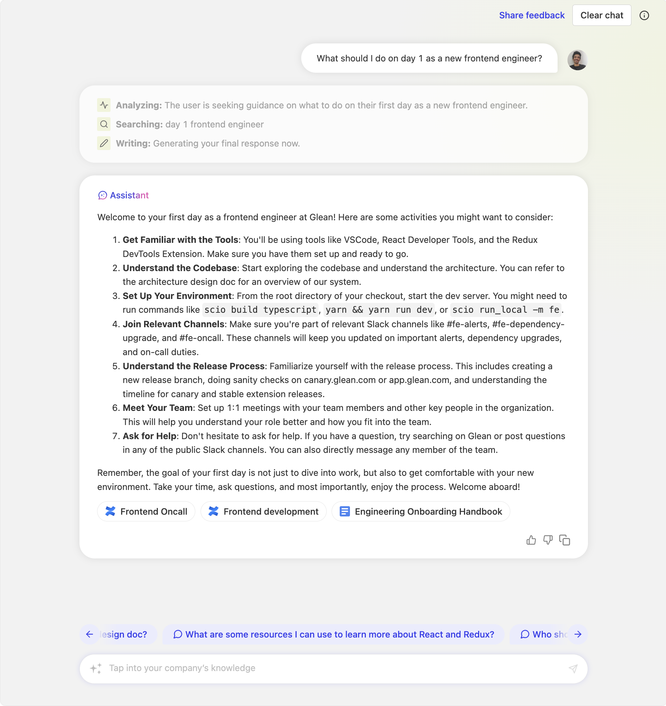
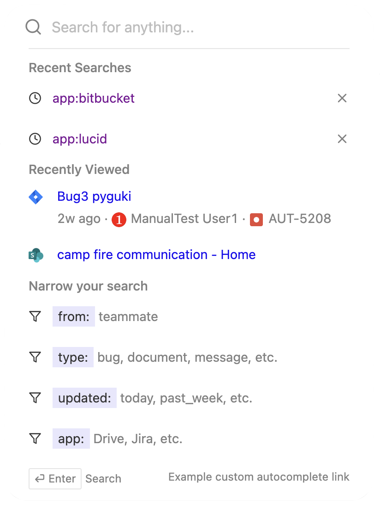
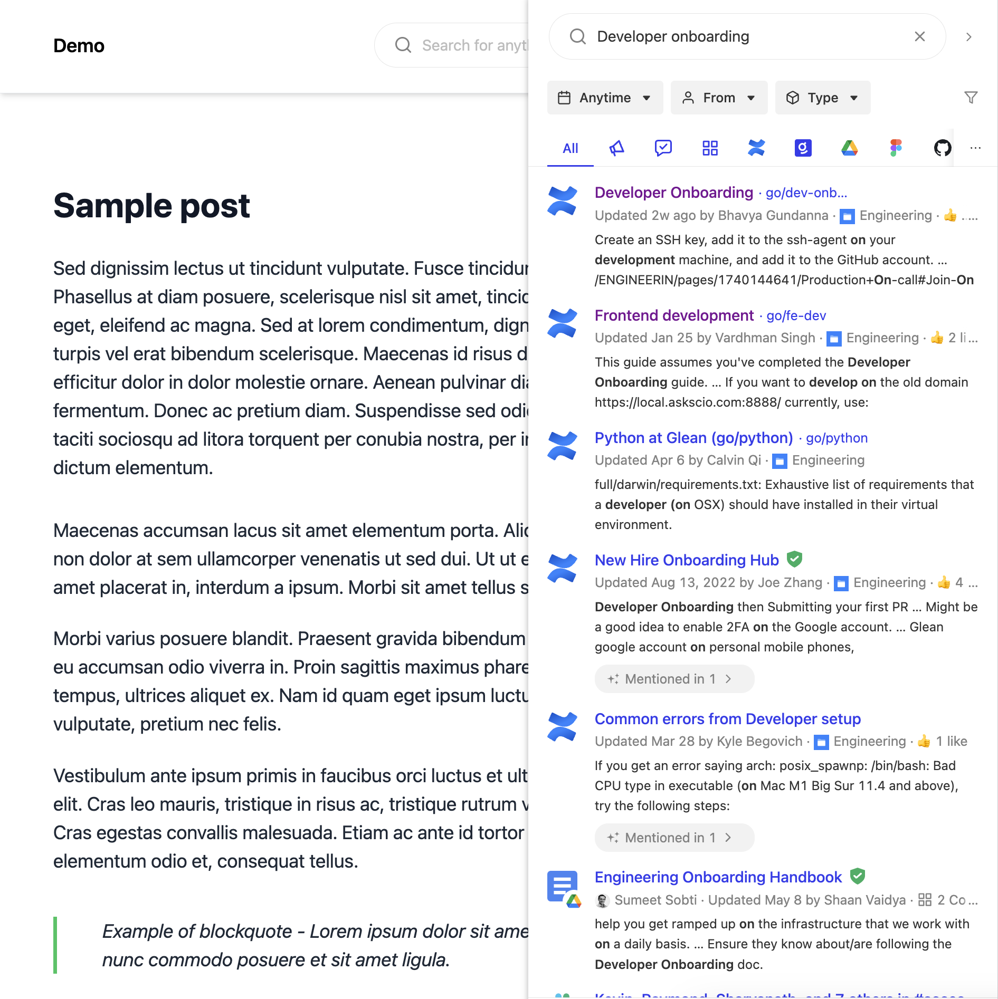
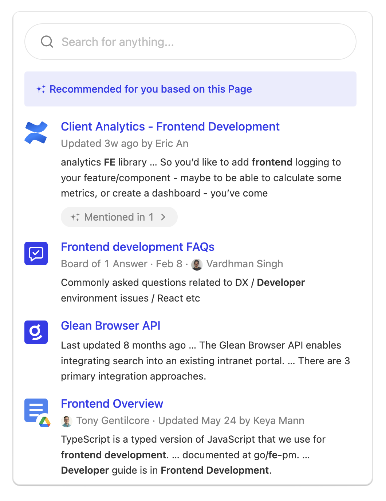
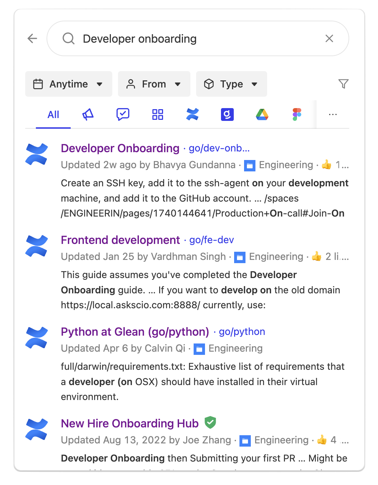

The Web SDK enables seamless integration of AI-powered search and chat functionalities into your existing intranet portal. Choose from various components to create a streamlined search experience tailored to your specific use case.

## Available Components

<CardGroup cols={1}>
  <Card
    title="Glean Chat"
    icon="comments"
    href="./components/chat">
    Embed a fully functional Chat component on your site with minimal code integration.

    <Frame>
      
    </Frame>

  </Card>

  <Card
    title="Autocomplete + Search Page"
    icon="magnifying-glass"
    href="./components/autocomplete">
    Build a customized search page by combining Glean's Autocomplete and Search Results components. This approach offers enhanced UI customization with minimal additional integration effort.

    <Frame>
      

        
        
      

    </Frame>
  </Card>

  <Card
    title="Modal Search"
    icon="window-maximize"
    href="./components/modal-search">
    Display search in a modal dialog overlay with single-line code implementation.

    <Frame>
      
    </Frame>
    <Frame>
      
    </Frame>

  </Card>

  <Card
    title="Sidebar Search"
    icon="sidebar"
    href="./components/sidebar">
    Access Glean search, chat, and contextual recommendations for the current page through a convenient sidebar interface.

    <Frame>
      

        
        
      

    </Frame>

  </Card>

  <Card
    title="Recommendations Component"
    icon="lightbulb"
    href="./components/recommendations">
    Embed contextual recommendations, search, and chat capabilities directly within your page layout.

    <Frame>
      

        
        
      

    </Frame>

  </Card>
</CardGroup>
