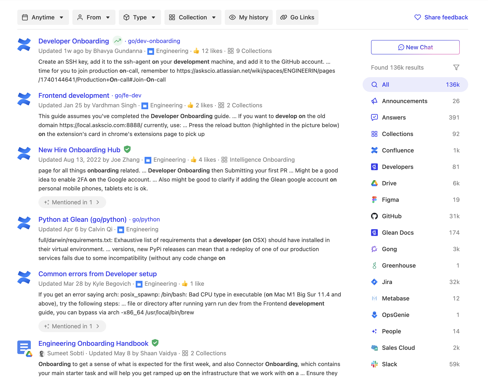

import Tabs from '@theme/Tabs';
import TabItem from '@theme/TabItem';


Create a full-featured search experience by integrating Glean's Autocomplete and Search Results components. This approach enables deep UI customization while maintaining straightforward implementation.

<Frame>
  <div className="grid grid-cols-2 gap-3">
    
    
  </div>
</Frame>

## Implementation Guide

### Adding the JavaScript Client

Include the JavaScript library in your page's `<head>` section. Replace `GLEAN_APP_DOMAIN` with your company's Glean web app domain (typically `app.glean.com` or `your-company.glean.com` for custom subdomains).

:::info
  The Glean web app domain differs from your company's Glean backend domain
  (which typically follows the format `your-company-be.glean.com`).
:::

<Tabs>
  <TabItem value="html" label="HTML">

  ```html
  <script
      defer
      src="https://{GLEAN_APP_DOMAIN}/embedded-search-latest.min.js"
    ></script>
  ```

  </TabItem>
</Tabs>

### Component Setup

The implementation requires two container elements with specific CSS properties and event handling to coordinate the search experience:

1. Create container elements with the following CSS properties:

   - `position: relative`
   - `display: block`
   - Appropriate sizing and positioning

2. Implement the search functionality with event handling:

<Tabs>
<TabItem value="search-implementation" label="Search Implementation">

```javascript
let currentQuery = undefined;

function renderSearchResults() {
  const resultsElement = this.template.querySelector('search-results');
  window.GleanWebSDK.renderSearchResults(resultsElement, {
    onSearch: (query) => {
      currentQuery = query;
      renderSearchBox();
    },
    query: currentQuery
  });
}

function renderSearchBox() {
  const autocompleteElement = this.template.querySelector('search-box');
  window.GleanWebSDK.renderSearchBox(autocompleteElement, {
    onSearch: (query) => {
      currentQuery = query;
      renderSearchResults();
    },
    query: currentQuery
  });
}

renderSearchBox();
```

</TabItem>
</Tabs>

## Customization Options

### Component APIs

The implementation provides extensive customization options through two primary APIs:

- [SearchBox API Documentation](https://app.glean.com/meta/browser_api/interfaces/GleanWebSDK.html#renderSearchBox)
- [Search Results API Documentation](https://app.glean.com/meta/browser_api/interfaces/GleanWebSDK.html#renderSearchResults)

### Theming

Customize the appearance using [SearchBoxCustomizations](https://app.glean.com/meta/browser_api/interfaces/SearchBoxCustomizations.html). The theming system is regularly expanded with additional options based on customer needs.

## Authentication

:::note
  Authentication involves two default steps that users must complete upon first usage. However, both steps can be optimized for a smoother user experience.
:::

### Default Authentication Flow
1. Email Address Entry
2. SSO Authentication

### Optimizing Authentication

You can streamline the authentication process in two ways:

1. **Skip Email Entry**: Implement the [backend](https://app.glean.com/meta/browser_api/interfaces/SearchOptions.html#backend) parameter to bypass the email entry step.

2. **Skip SSO Authentication**: Configure a [server-to-server handshake](https://docs.google.com/document/d/12q1oQWwhkLQyIHXKE7OF6XtvJZ5av50Wd_NKUbRh5u4/edit) and provide the user's auth token via [Options.authToken](https://app.glean.com/meta/browser_api/interfaces/Options.html#authToken).

:::warning
  When implementing auth token authentication:
  - You must configure an [onAuthTokenRequired](https://app.glean.com/meta/browser_api/interfaces/Options.html#onAuthTokenRequired) callback
  - This callback handles token refresh when expiration approaches
  - Server-to-server authentication becomes mandatory if third-party cookies are blocked in the user's browser
:::

## Implementation Example

View a complete working implementation of the Autocomplete with Search components in our interactive demo:

<Frame>
  <iframe
    src="https://codepen.io/GleanWork/embed/VwWJOjZ?default-tab=js%2Cresult&editable=true"
    style={{width: '100%', height: '500px'}}
    title="Autocomplete with Search | Glean"
  />
</Frame>
```
